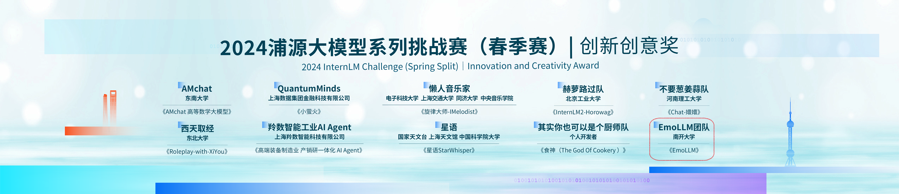
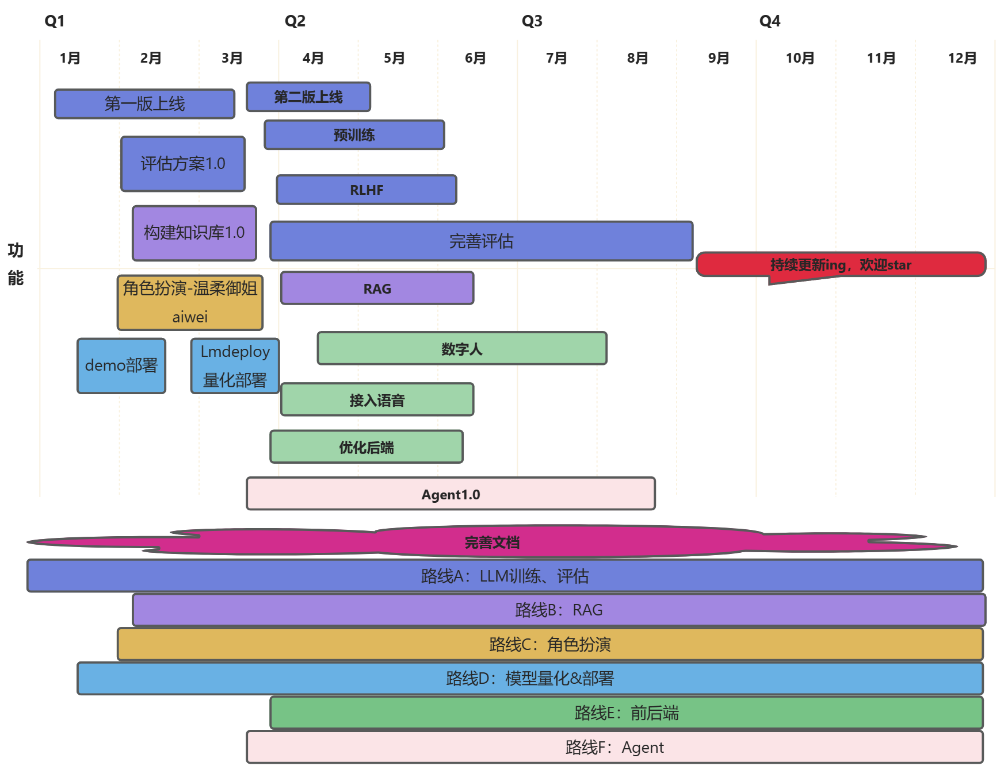
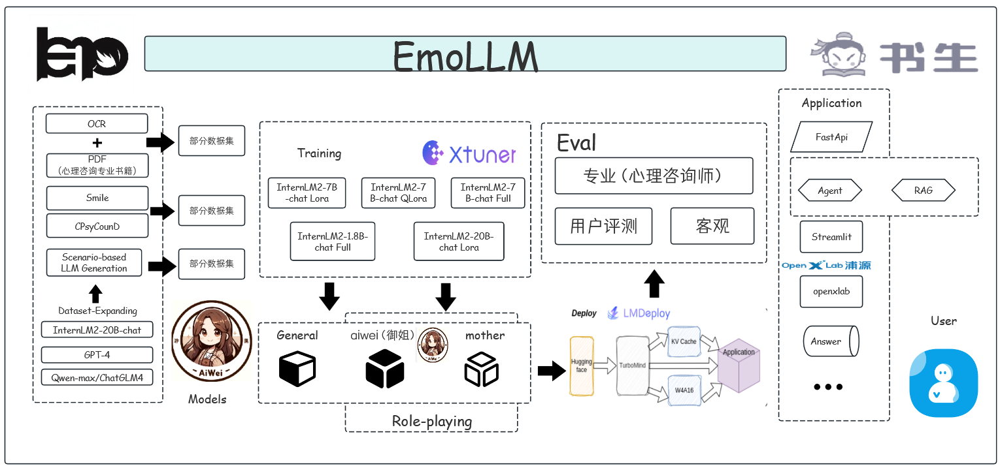

<div align="center"> 

# EmoLLM-心理健康大模型

</div>

<p align="center">
  <a href="https://github.com/SmartFlowAI/EmoLLM/">
    
  </a>

<div align="center">

<!-- PROJECT SHIELDS -->
[![Contributors][contributors-shield]][contributors-url]
[![Forks][forks-shield]][forks-url]
[![Issues][issues-shield]][issues-url]
[![OpenXLab_App][OpenXLab_App-image]][OpenXLab_App-url]
[![OpenXLab_Model][OpenXLab_Model-image]][OpenXLab_Model-url] 
[![MIT License][license-shield]][license-url]
[![Stargazers][stars-shield]][stars-url]

</div>

<h3 align="center">EmoLLM</h3>

  <div align="center">
      简体中文| <a href="README_EN.md" >English</a>
    <br />
    <br />
    <a href="https://github.com/SmartFlowAI/EmoLLM"><strong>探索本项目的文档 »</strong></a>
    <br />
    <br />
    <a href="https://openxlab.org.cn/apps/detail/Farewell1/EmoLLMV2.0">体验EmoLLM 2.0</a>
    ·
    <a href="https://github.com/SmartFlowAI/EmoLLM/issues">报告Bug</a>
    ·
    <a href="https://github.com/SmartFlowAI/EmoLLM/issues">提出新特性</a>
  </div>

<!-- 本篇README.md面向开发者 -->

**EmoLLM** 是一系列能够支持 **理解用户-支持用户-帮助用户** 心理健康辅导链路的心理健康大模型，由 `LLM`指令微调而来，欢迎大家star~⭐⭐。目前已经开源的 `LLM` 微调配置如下：

<div align="center">

|         模型          |   类型   |                                                   链接                                                   | 模型链接   |
| :-------------------: | :------: | :------------------------------------------------------------------------------------------------------: |:------: |
|   InternLM2_5_7B_chat   |  全量微调   |  [internlm2_5_chat_7b_full.py](./xtuner_config/internlm2_5_chat_7b_full.py) | [OpenXLab](https://openxlab.org.cn/models/detail/chg0901/EmoLLM_V3.0), [ModelScope](https://modelscope.cn/models/chg0901/EmoLLMV3.0) |
|   InternLM2_5_7B_chat   |  QLoRA   |  [internlm2_5_chat_7b_qlora_oasst1_e3.py](./xtuner_config/internlm2_5_chat_7b_qlora_oasst1_e3.py) |[ModelScope](https://www.modelscope.cn/models/z342994309/emollm_interlm2_5/)  |
|   InternLM2_7B_chat   |  QLoRA   |  [internlm2_7b_chat_qlora_e3.py](./xtuner_config/internlm2_7b_chat_qlora_e3.py) | [ModelScope](https://modelscope.cn/models/aJupyter/EmoLLM/files) |
|   InternLM2_7B_chat   | 全量微调 | [internlm2_chat_7b_full.py](./xtuner_config/internlm2_chat_7b_full.py)  | [OpenXLab](https://openxlab.org.cn/models/detail/ajupyter/EmoLLM_internlm2_7b_full) |
|   InternLM2_7B_base   |  QLoRA   | [internlm2_7b_base_qlora_e10_M_1e4_32_64.py](./xtuner_config/internlm2_7b_base_qlora_e10_M_1e4_32_64.py) |[OpenXLab](https://openxlab.org.cn/models/detail/chg0901/EmoLLM-InternLM7B-base-10e), [ModelScope](https://www.modelscope.cn/models/chg0901/EmoLLM-InternLM7B-base-10e/summary) |
|  InternLM2_1_8B_chat  | 全量微调 |  [internlm2_1_8b_full_alpaca_e3.py](./xtuner_config/internlm2_1_8b_full_alpaca_e3.py)  | [OpenXLab](https://openxlab.org.cn/models/detail/ajupyter/EmoLLM_internlm2_1_8b_full/tree/main), [ModelScope](https://modelscope.cn/models/aJupyter/EmoLLM_PT_InternLM1.8B-chat/files) |
|  InternLM2_20B_chat   |   LoRA   |[internlm2_20b_chat_lora_alpaca_e3.py](./xtuner_config/internlm2_20b_chat_lora_alpaca_e3.py)| |
|     Qwen_7b_chat      |  QLoRA   |  [qwen_7b_chat_qlora_e3.py](./xtuner_config/qwen_7b_chat_qlora_e3.py) | |
|   Qwen1_5-0_5B-Chat   | 全量微调 |   [qwen1_5_0_5_B_full.py](./xtuner_config/qwen1_5_0_5_B_full.py) | [ModelScope](https://www.modelscope.cn/models/aJupyter/EmoLLM_Qwen1_5-0_5B-Chat_full_sft/summary) |
|  Baichuan2_13B_chat   |  QLoRA   |   [baichuan2_13b_chat_qlora_alpaca_e3.py](./xtuner_config/baichuan2_13b_chat_qlora_alpaca_e3.py) | |
|      ChatGLM3_6B      |   LoRA   |   [chatglm3_6b_lora_alpaca_e3.py](./xtuner_config/chatglm3_6b_lora_alpaca_e3.py)  | |
| DeepSeek MoE_16B_chat |  QLoRA   |  [deepseek_moe_16b_chat_qlora_oasst1_e3.py](./xtuner_config/deepseek_moe_16b_chat_qlora_oasst1_e3.py)    | |
| Mixtral 8x7B_instruct |  QLoRA   | [mixtral_8x7b_instruct_qlora_oasst1_e3.py](./xtuner_config/mixtral_8x7b_instruct_qlora_oasst1_e3.py)    | |
| LLaMA3_8b_instruct    |  QLoRA   | [aiwei_llama3_8b_instruct_qlora_e3.py](./xtuner_config/aiwei_llama3_8b_instruct_qlora_e3.py) | [OpenXLab](https://openxlab.org.cn/models/detail/ajupyter/EmoLLM-LLaMA3_8b_instruct_aiwei/tree/main), [ModelScope](https://modelscope.cn/models/aJupyter/EmoLLM-LLaMA3_8b_instruct_aiwei/files) |
| LLaMA3_8b_instruct    |  QLoRA   | [llama3_8b_instruct_qlora_alpaca_e3_M_ruozhi_scM.py](./xtuner_config/llama3_8b_instruct_qlora_alpaca_e3_M_ruozhi_scM.py)    |[OpenXLab](https://openxlab.org.cn/models/detail/chg0901/EmoLLM-Llama3-8B-Instruct3.0), [ModelScope](https://modelscope.cn/models/chg0901/EmoLLM-Llama3-8B-Instruct3.0/summary) |
|          ……           |    ……    |                                                    ……                                                    | …… |

</div>

欢迎大家为本项目做出贡献~

---

心理健康大模型（Mental Health Grand Model）是一个综合性的概念，它旨在全面理解和促进个体、群体乃至整个社会的心理健康状态。这个模型通常包含以下几个关键组成部分：

- 认知因素：涉及个体的思维模式、信念系统、认知偏差以及解决问题的能力。认知因素对心理健康有重要影响，因为它们影响个体如何解释和应对生活中的事件。
- 情感因素：包括情绪调节、情感表达和情感体验。情感健康是心理健康的重要组成部分，涉及个体如何管理和表达自己的情感，以及如何从负面情绪中恢复。
- 行为因素：涉及个体的行为模式、习惯和应对策略。这包括应对压力的技巧、社交技能以及自我效能感，即个体对自己能力的信心。
- 社会环境：包括家庭、工作、社区和文化背景等外部因素，这些因素对个体的心理健康有着直接和间接的影响。
- 生理健康：身体健康与心理健康紧密相关。良好的身体健康可以促进心理健康，反之亦然。
- 心理韧性：指个体在面对逆境时的恢复力和适应能力。心理韧性强的人更能够从挑战中恢复，并从中学习和成长。
- 预防和干预措施：心理健康大模型还包括预防心理问题和促进心理健康的策略，如心理教育、心理咨询、心理治疗和社会支持系统。
- 评估和诊断工具：为了有效促进心理健康，需要有科学的工具来评估个体的心理状态，以及诊断可能存在的心理问题。

<table>
    <tr>
        <td align="center" style="background-color: transparent">
            
        </td>
        <td align="center" style="background-color: transparent">
            
        </td>
    </tr>
    <tr>
        <td align="center" style="background-color: transparent">
            
        </td>
        <td align="center" style="background-color: transparent">
            
        </td>
    </tr>
</table>

## 🎇最近更新
- 【2024.07.16】欢迎大家体验 EmoLLM V3.0 ，该模型是基于InternLM2.5-7B-Chat模型的全量微调，微调配置文件地址：[internlm2_5_chat_7b_full.py](./xtuner_config/internlm2_5_chat_7b_full.py) ，模型权重链接：[OpenXLab](https://openxlab.org.cn/models/detail/chg0901/EmoLLM_V3.0), [ModelScope](https://modelscope.cn/models/chg0901/EmoLLMV3.0) ，WebDemo地址： [OpenXLab apps](https://openxlab.org.cn/apps/detail/chg0901/EmoLLMV3.0), [配套全量微调知乎教程](https://zhuanlan.zhihu.com/p/708931911)。
- 【2024.07】欢迎大家使用稳定版 EmoLLM V2.0 进行日常使用和学术研究，模型权重链接：[OpenXLab](https://openxlab.org.cn/models/detail/ajupyter/EmoLLM_internlm2_7b_full/tree/main)。
- 【2024.07】新增基于InternLM2_5_7B_chat[微调配置](./xtuner_config/internlm2_5_chat_7b_qlora_oasst1_e3.py)、模型文件发布在 [ModelScope](https://www.modelscope.cn/models/z342994309/emollm_interlm2_5/)。
- 【2024.06】新增基于[LLaMA-Factory](https://github.com/hiyouga/LLaMA-Factory)[GLM4-9B-chat微调指南](./doc/GLM-4-9B-chat%20Lora%20微调（llama-factory）.md)、新增[基于swift的微调指南](./swift/)、论文[ESC-Eval: Evaluating Emotion Support Conversations in Large Language Models](https://arxiv.org/abs/2406.14952)引用了EmoLLM且EmoLLM取得了较好的效果。
- 【2024.05.28】EmoLLM使用的多轮对话数据集CPsyCounD和专业评测方法已公开，详见2024 ACL findings[《CPsyCoun: A Report-based Multi-turn Dialogue Reconstruction and Evaluation Framework for Chinese Psychological Counseling》](https://arxiv.org/abs/2405.16433)!
- 【2024.05.08】EmoLLM**爹系男友阅览体验版**上线 [1. **百度AppBuilder**](https://appbuilder.baidu.com/s/4cLyw) [2. **OpenXLab**](https://openxlab.org.cn/apps/detail/chg0901/EmoLLM3.0_Gradio_Llama3-8B-Instruct3.0), 欢迎点赞收藏
- 【2024.05.07】[增量预训练指南](xtuner_config/pt/README.md)
- 【2024.05.04】基于LLaMA3_8b_instruct的[EmoLLM3.0 OpenXLab Demo](https://st-app-center-006861-9746-jlroxvg.openxlab.space/)上线（[重启链接](https://openxlab.org.cn/apps/detail/chg0901/EmoLLM-Llama3-8B-Instruct3.0)）, [**LLAMA3微调指南**](xtuner_config/README_llama3_8b_instruct_qlora_alpaca_e3_M.md)**更新**，在[**OpenXLab**](https://openxlab.org.cn/models/detail/chg0901/EmoLLM-Llama3-8B-Instruct3.0)和[**ModelScope**](https://modelscope.cn/models/chg0901/EmoLLM-Llama3-8B-Instruct3.0/summary)平台发布**LLaMA3_8b_instruct-8B QLoRA微调模型 EmoLLM3.0权重**
- 【2024.04.20】[LLAMA3微调指南](xtuner_config/README_llama3_8b_instruct_qlora_alpaca_e3_M.md)及基于[LLaMA3_8b_instruct的艾薇](https://openxlab.org.cn/models/detail/ajupyter/EmoLLM-LLaMA3_8b_instruct_aiwei)开源
- 【2023.04.14】新增[快速开始](docs/quick_start.md)和保姆级教程[BabyEmoLLM](Baby_EmoLLM.ipynb)
- 【2024.04.02】在 Huggingface 上传[老母亲心理咨询师](https://huggingface.co/brycewang2018/EmoLLM-mother/tree/main)
- 【2024.03.25】在百度飞桨平台发布[爹系男友心理咨询师](https://aistudio.baidu.com/community/app/68787)
- 【2024.03.24】在**OpenXLab**和**ModelScope**平台发布**InternLM2-Base-7B QLoRA微调模型**, 具体请查看[**InternLM2-Base-7B QLoRA**](./xtuner_config/README_internlm2_7b_base_qlora.md)
- 【2024.03.12】在百度飞桨平台发布[艾薇](https://aistudio.baidu.com/community/app/63335)
- 【2024.03.11】 **EmoLLM V2.0 相比 EmoLLM V1.0 全面提升，已超越 Role-playing ChatGPT 在心理咨询任务上的能力！**[点击体验EmoLLM V2.0](https://openxlab.org.cn/apps/detail/Farewell1/EmoLLMV2.0)，更新[数据集统计及详细信息](./datasets/)、[路线图](./assets/Roadmap_ZH.png)
- 【2024.03.09】 新增并发功能加速 [QA 对生成](./scripts/qa_generation/)、[RAG pipeline](./rag/)
- 【2024.03.03】 [基于InternLM2-7B-chat全量微调版本EmoLLM V2.0开源](https://openxlab.org.cn/models/detail/ajupyter/EmoLLM_internlm2_7b_full)，需要两块A100*80G，更新专业评估，详见[evaluate](./evaluate/)，更新基于PaddleOCR的PDF转txt工具脚本，详见[scripts](./scripts/)
- 【2024.02.29】更新客观评估计算，详见[evaluate](./evaluate/)，更新一系列数据集，详见[datasets](./datasets/)
- 【2024.02.27】更新英文readme和一系列数据集（舔狗和单轮对话）
- 【2024.02.23】推出基于InternLM2_7B_chat_qlora的 `温柔御姐心理医生艾薇`，[点击获取模型权重](https://openxlab.org.cn/models/detail/ajupyter/EmoLLM_aiwei)，[配置文件](xtuner_config/aiwei-internlm2_chat_7b_qlora.py)，[在线体验链接](https://openxlab.org.cn/apps/detail/ajupyter/EmoLLM-aiwei)
- 【2024.02.23】更新[若干微调配置](/xtuner_config/)，新增 [data_pro.json](/datasets/data_pro.json)（数量更多、场景更全、更丰富）和 [aiwei.json](/datasets/aiwei.json)（温柔御姐角色扮演专用，带有Emoji表情），即将推出 `温柔御姐心理医生艾薇`
- 【2024.02.18】 [基于Qwen1_5-0_5B-Chat全量微调版本开源](https://www.modelscope.cn/models/aJupyter/EmoLLM_Qwen1_5-0_5B-Chat_full_sft/summary)，算力有限的道友可以玩起来~

<details>
<summary>查看更多</summary>

- 【2024.02.06】 EmoLLM在[**Openxlab** ](https://openxlab.org.cn/models/detail/jujimeizuo/EmoLLM_Model) 平台下载量高达18.7k，欢迎大家体验！

<p align="center"> 
  
</p>

- 【2024.02.05】 项目荣获公众号**NLP工程化**推文宣传[推文链接](https://mp.weixin.qq.com/s/78lrRl2tlXEKUfElnkVx4A)，为博主推广一波，欢迎大家关注！！🥳🥳

<p align="center">
  
</p>

- 【2024.02.03】 [项目宣传视频](https://www.bilibili.com/video/BV1N7421N76X/)完成 😊
- 【2024.01.27】 完善数据构建文档、微调指南、部署指南、Readme等相关文档 👏
- 【2024.01.25】 EmoLLM V1.0 已部署上线 https://openxlab.org.cn/apps/detail/jujimeizuo/EmoLLM 😀

</details>

## 🏆荣誉栏

- 项目荣获上海人工智能实验室举办的**2024浦源大模型系列挑战赛春季赛*****创新创意奖***

<p align="center">
   <a href="https://github.com/SmartFlowAI/EmoLLM/">
    
</p>

- 荣获[AI 赋能大学计划“全国高校行”](https://mp.weixin.qq.com/s/yyaulQ1wBzKq5cXaGl2Wag)一等奖

- 🎉感谢以下媒体及公众号朋友对本项目的报道和支持(以下排名不分先后! 若有遗漏、十分抱歉, 一并感激! 欢迎补充!): [NLP工程化](https://mp.weixin.qq.com/s/78lrRl2tlXEKUfElnkVx4A), [机智流](https://mp.weixin.qq.com/s/_wMCmssRMGd0Oz5OVVkjAA), [爱可可爱生活](https://mp.weixin.qq.com/s/4WaCg4OpkCWXEuWHuV4r3w), [阿郎小哥](https://mp.weixin.qq.com/s/_MSMeL1XHP0v5lDi3YaPVw), [大模型日知路](https://mp.weixin.qq.com/s/FYYibsCXtfU6FFM9TuKILA), [AI Code](https://mp.weixin.qq.com/s/yDWGY3S4CwCi6U_irsFmqA) 等!

- 项目宣传视频 [EmoLLM](https://www.bilibili.com/video/BV1N7421N76X/) 已发布，欢迎大家围观 😀

## 🎯路线图

<p align="center">
  <a href="https://github.com/SmartFlowAI/EmoLLM/">
    
  </a>

## 🔗框架图

<p align="center">
  <a href="https://github.com/SmartFlowAI/EmoLLM/">
    
  </a>

## 目录

- [EmoLLM-心理健康大模型](#emollm-心理健康大模型)
  - [🎇最近更新](#最近更新)
  - [🏆荣誉栏](#荣誉栏)
  - [🎯路线图](#路线图)
  - [🔗框架图](#框架图)
  - [目录](#目录)
          - [开发前的配置要求](#开发前的配置要求)
          - [使用指南](#使用指南)
    - [🍪快速体验](#快速体验)
    - [📌数据构建](#数据构建)
    - [🎨微调指南](#微调指南)
    - [🔧部署指南](#部署指南)
    - [⚙RAG(检索增强生成)](#rag检索增强生成)
    - [🎓评测指南](#评测指南)
    - [使用到的框架](#使用到的框架)
      - [如何参与本项目](#如何参与本项目)
    - [作者（排名不分先后）](#作者排名不分先后)
    - [版权说明](#版权说明)
    - [引用](#引用)
    - [特别鸣谢](#特别鸣谢)
      - [相关项目](#相关项目)
      - [人员](#人员)
  - [Star History](#star-history)
  - [🌟 Contributors](#-contributors)
  - [交流群](#交流群)

###### 开发前的配置要求

- 硬件：A100 40G（仅针对InternLM2_7B_chat+qlora微调+deepspeed zero2优化）

###### 使用指南

1. Clone the repo

```sh
git clone https://github.com/SmartFlowAI/EmoLLM.git
```

2. 依次阅读或者选择感兴趣的部分阅读：
   - [快速体验](#快速体验)
   - [数据构建](#数据构建)
   - [微调指南](#微调指南)
   - [部署指南](#部署指南)
   - [RAG](#rag检索增强生成)
   - [评测指南](#评测指南)
   - 查看更多详情


### 🍪快速体验

- 请阅读[快速体验](quick_start/quick_start.md)查阅
- 快速上手：[Baby EmoLLM](quick_start/Baby_EmoLLM.ipynb)


### 📌数据构建

- 请阅读[数据构建指南](generate_data/tutorial.md)查阅

- 微调用到的数据集见[datasets](datasets/data.json)

### 🎨微调指南

详见[微调指南](xtuner_config/README.md)

### 🔧部署指南

- Demo部署：详见[部署指南](demo/README.md)
- 基于[LMDeploy](https://github.com/InternLM/lmdeploy/)的量化部署：详见[deploy](./deploy/lmdeploy.md)

### ⚙RAG(检索增强生成)

- 详见[RAG](rag/README.md)

### 🎓评测指南

- 本模型评测分为通用评测和专业评测，请阅读[评测指南](evaluate/README.md)查阅

<details>
<summary>更多详情</summary>

### 使用到的框架

- [Xtuner](https://github.com/InternLM/xtuner)：用于微调
- [Transformers](https://github.com/huggingface/transformers)
- [Pytorch](https://pytorch.org/)
- [LMDeploy](https://github.com/InternLM/lmdeploy/)：用于量化部署
- [Stremlit](https://streamlit.io/)：用于构建Demo
- [DeepSpeed](https://github.com/microsoft/DeepSpeed)：并行训练
- …

#### 如何参与本项目

贡献使开源社区成为一个学习、激励和创造的绝佳场所。你所作的任何贡献都是**非常感谢**的。

1. Fork the Project
2. Create your Feature Branch (`git checkout -b feature/AmazingFeature`)
3. Commit your Changes (`git commit -m 'Add some AmazingFeature'`)
4. Push to the Branch (`git push origin feature/AmazingFeature`)
5. Open a Pull Request

</details>

### 作者（排名不分先后）

|                            用户名                            |                     学校/组织                      |                             备注                             |                     贡献                      |
| :----------------------------------------------------------: | :------------------------------------------------: | :----------------------------------------------------------: | :-------------------------------------------: |
|           [aJupyter](https://github.com/aJupyter)            |                  南开大学在读硕士                  |                        DataWhale成员                         |                  项目发起人                   |
|           [MING-ZCH](https://github.com/MING-ZCH)            |               华中科技大学在读本科生               |                   LLM x Mental health 研究者                  |                项目联合负责人                 |
|            [chg0901](https://github.com/chg0901)             | 韩国光云大学在读博士 [MiniSora](https://github.com/mini-sora/minisora/)          | DataWhale意向成员 DataWhale鲸英助教团成员          |                项目联合负责人                 |
|         [jujimeizuo](https://github.com/jujimeizuo)          |                  江南大学在读硕士                  |                                                              |                                               |
| [Smiling-Weeping-zhr](https://github.com/Smiling-Weeping-zhr) |          哈尔滨工业大学（威海）在读本科生          |                                                              |                                               |
|             [8baby8](https://github.com/8baby8)              |                 飞桨领航团区域主管                 |                     文心大模型核心开发者                     |                                               |
|             [zxazys](https://github.com/zxazys)              |                  南开大学在读硕士                  |                                                              |                                               |
|   [JasonLLLLLLLLLLL](https://github.com/JasonLLLLLLLLLLL)    |                       swufe                        |                                                              |                                               |
|            [MrCatAI](https://github.com/MrCatAI)             |                      AI搬用工                      |                                                              |                                               |
|             [ZeyuBa](https://github.com/ZeyuBa)              |                  自动化所在读硕士                  |                                                              |                                               |
|   [aiyinyuedejustin](https://github.com/aiyinyuedejustin)    |               宾夕法尼亚大学在读硕士               |                                                              |                                               |
|          [Nobody-ML](https://github.com/Nobody-ML)           |           中国石油大学（华东）在读本科生           |                                                              |                                               |
|             [Mxoder](https://github.com/Mxoder)              |             北京航空航天大学在读本科生             |                                                              |                                               |
|           [Anooyman](https://github.com/Anooyman)            |                  南京理工大学硕士                  |                                                              |                                               |
|         [Vicky-3021](https://github.com/Vicky-3021)          |            西安电子科技大学硕士（研0）             |                                                              |                                               |
|        [SantiagoTOP](https://github.com/santiagoTOP)         |                太原理工大学在读硕士                |                                                              |      数据清洗，文档管理、Baby EmoLLM维护      |
|        [zealot52099](https://github.com/zealot52099)         |                     个人开发者                     |                                                              |            清洗数据、LLM微调、RAG             |
|            [wwwyfff](https://github.com/wwwyfff)             |                  复旦大学在读硕士                  |                                                              |                                               |
|           [Yicooong](https://github.com/Yicooong)            |                  南开大学在读硕士                  |                                                              |                                               |
|            [jkhumor](https://github.com/jkhumor)             |                  南开大学在读硕士                  |                                                              |                      RAG                      |
|       [lll997150986](https://github.com/lll997150986)        |                  南开大学在读硕士                  |                                                              |                     微调                      |
|          [nln-maker](https://github.com/nln-maker)           |                  南开大学在读硕士                  |                                                              |                  前后端开发                   |
|         [dream00001](https://github.com/dream00001)          |                  南开大学在读硕士                  |                                                              |                  前后端开发                   |
|     [王几行XING](https://zhihu.com/people/brycewang1898)     |                  北京大学硕士毕业                  |                                                              |         清洗数据、LLM微调、前后端开发         |
|                            [思在]                            |            北京大学硕士毕业（微软美国）            |                                                              |              LLM微调、前后端开发              |
|       [TingWei](https://github.com/wwewwt)        |                  电子科技大学硕士毕业                  |     微信公众号：AI大模型在手                                                         |                     微调                      |
|     [PengYu](https://github.com/hi-pengyu)     |                  石河子大学在读硕士                  |                                                              |         LLM微调         |
### 版权说明

该项目签署了 MIT 授权许可，详情请参阅 [LICENSE](https://github.com/SmartFlowAI/EmoLLM/blob/main/LICENSE)

### 引用

如果本项目对您的工作有所帮助，请使用以下格式引用：

```bibtex
@misc{EmoLLM,
    title={EmoLLM},
    author={EmoLLM},
    url={https://github.com/SmartFlowAI/EmoLLM/},
    year={2024}
}
```

### 特别鸣谢

#### 相关项目
- [CPsyCoun](https://github.com/CAS-SIAT-XinHai/CPsyCoun)
- [Smile](https://github.com/qiuhuachuan/smile)
- [SoulChat](https://github.com/scutcyr/SoulChat)

#### 人员
- [上海人工智能实验室](https://www.shlab.org.cn/)
- [闻星（浦语小助手）](https://github.com/vansin)
- 阿布（北大心理学硕士）
- [Sanbu](https://github.com/sanbuphy)
- [HatBoy](https://github.com/hatboy)

<!-- links -->

<!-- [linkedin-shield]: https://img.shields.io/badge/-LinkedIn-black.svg?style=flat-square&logo=linkedin&colorB=555 -->

<!-- [linkedin-url]: https://linkedin.com/in/aJupyter -->

## Star History

[](https://star-history.com/#SmartFlowAI/EmoLLM&Date)

## 🌟 Contributors

[](https://github.com/SmartFlowAI/EmoLLM/graphs/contributors)

[your-project-path]: SmartflowAI/EmoLLM
[contributors-shield]: https://img.shields.io/github/contributors/SmartflowAI/EmoLLM.svg?style=flat-square
[contributors-url]: https://github.com/SmartflowAI/EmoLLM/graphs/contributors
[forks-shield]: https://img.shields.io/github/forks/SmartflowAI/EmoLLM.svg?style=flat-square
[forks-url]: https://github.com/SmartflowAI/EmoLLM/network/members
[stars-shield]: https://img.shields.io/github/stars/SmartflowAI/EmoLLM.svg?style=flat-square
[stars-url]: https://github.com/SmartflowAI/EmoLLM/stargazers
[issues-shield]: https://img.shields.io/github/issues/SmartflowAI/EmoLLM.svg?style=flat-square
[issues-url]: https://img.shields.io/github/issues/SmartflowAI/EmoLLM.svg
[license-shield]: https://img.shields.io/github/license/SmartflowAI/EmoLLM.svg?style=flat-square
[license-url]: https://github.com/SmartFlowAI/EmoLLM/blob/main/LICENSE

[OpenXLab_App-image]: https://cdn-static.openxlab.org.cn/app-center/openxlab_app.svg
[OpenXLab_Model-image]: https://cdn-static.openxlab.org.cn/header/openxlab_models.svg
[OpenXLab_App-url]: https://openxlab.org.cn/apps/detail/Farewell1/EmoLLMV2.0
[OpenXLab_Model-url]: https://openxlab.org.cn/models/detail/ajupyter/EmoLLM_internlm2_7b_full

## 交流群

- 如果失效，请移步Issue区

<p align="center">
  
</p>
