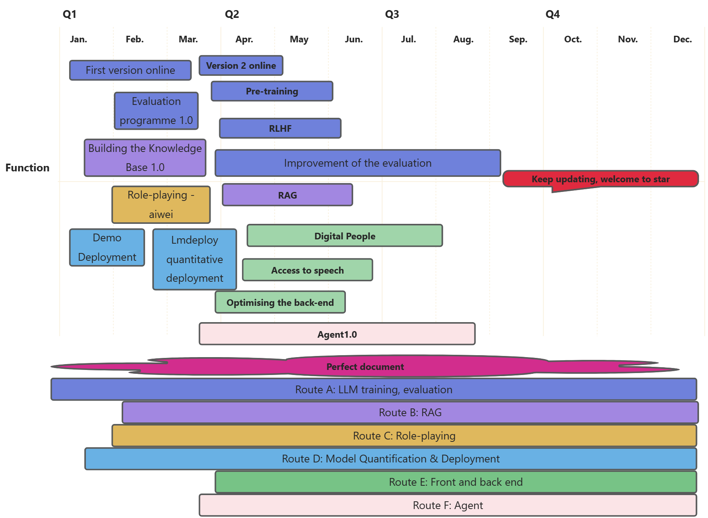

<div align="center"> 

# EmoLLM - Large Language Model for Mental Health

</div>

<p align="center">
  <a href="https://github.com/SmartFlowAI/EmoLLM/">
    
  </a>

<div align="center">

<!-- PROJECT SHIELDS -->
[![Contributors][contributors-shield]][contributors-url]
[![Forks][forks-shield]][forks-url]
[![Issues][issues-shield]][issues-url]
[![OpenXLab_App][OpenXLab_App-image]][OpenXLab_App-url]
[![OpenXLab_Model][OpenXLab_Model-image]][OpenXLab_Model-url] 
[![MIT License][license-shield]][license-url]
[![Stargazers][stars-shield]][stars-url]

</div>

<h3 align="center">EmoLLM</h3>

  <p align="center">
  <a href="README.md">简体中文</a> | English
    <br />
    <br />
    <a href="https://github.com/SmartFlowAI/EmoLLM"><strong>Explore the documentation of this project »</strong></a>
    <br />
    <br />
    <a href="https://openxlab.org.cn/apps/detail/Farewell1/EmoLLMV2.0">EmoLLM 2.0 Demo</a>
    ·
    <a href="https://github.com/SmartFlowAI/EmoLLM/issues">Report a Bug</a>
    ·
    <a href="https://github.com/SmartFlowAI/EmoLLM/issues">Propose a New Feature</a>
  </p>

</p>

<!-- 本篇README.md面向开发者 -->

**EmoLLM** is a series of large language models designed to understand, support and help customers in mental health counseling. It is fine-tuned from the LLM instructions. We really appreciate it if you could give it a star~⭐⭐. The open-sourced configuration is as follows:

<div align="center">

|         Model         |       Type       | File Links  | Model Links  |
| :-------------------: | :------: | :------------------------------------------------------------------------------------------------------: |:------: |
|   InternLM2_5_7B_chat   |  全量微调   |  [internlm2_chat_7b_full.py](./xtuner_config/internlm2_chat_7b_full.py) | [OpenXLab](https://openxlab.org.cn/models/detail/chg0901/EmoLLM_V3.0), [ModelScope](https://modelscope.cn/models/chg0901/EmoLLMV3.0) |
|   InternLM2_5_7B_chat   |  QLORA   |  [internlm2_5_chat_7b_qlora_oasst1_e3.py](./xtuner_config/internlm2_5_chat_7b_qlora_oasst1_e3.py) |[ModelScope](https://www.modelscope.cn/models/z342994309/emollm_interlm2_5/)  |
|   InternLM2_7B_chat   |  QLORA   |  [internlm2_7b_chat_qlora_e3.py](./xtuner_config/internlm2_7b_chat_qlora_e3.py) | [ModelScope](https://modelscope.cn/models/aJupyter/EmoLLM/files) |
|   InternLM2_7B_chat   | full fine-tuing | [internlm2_chat_7b_full.py](./xtuner_config/internlm2_chat_7b_full.py)  | [OpenXLab](https://openxlab.org.cn/models/detail/ajupyter/EmoLLM_internlm2_7b_full) |
|   InternLM2_7B_base   |  QLORA   | [internlm2_7b_base_qlora_e10_M_1e4_32_64.py](./xtuner_config/internlm2_7b_base_qlora_e10_M_1e4_32_64.py) |[OpenXLab](https://openxlab.org.cn/models/detail/chg0901/EmoLLM-InternLM7B-base-10e), [ModelScope](https://www.modelscope.cn/models/chg0901/EmoLLM-InternLM7B-base-10e/summary) |
|  InternLM2_1_8B_chat  | full fine-tuing |  [internlm2_1_8b_full_alpaca_e3.py](./xtuner_config/internlm2_1_8b_full_alpaca_e3.py)  | [OpenXLab](https://openxlab.org.cn/models/detail/ajupyter/EmoLLM_internlm2_1_8b_full/tree/main), [ModelScope](https://modelscope.cn/models/aJupyter/EmoLLM_PT_InternLM1.8B-chat/files) |
|  InternLM2_20B_chat   |   LORA   |[internlm2_20b_chat_lora_alpaca_e3.py](./xtuner_config/internlm2_20b_chat_lora_alpaca_e3.py)| |
|     Qwen_7b_chat      |  QLORA   |  [qwen_7b_chat_qlora_e3.py](./xtuner_config/qwen_7b_chat_qlora_e3.py) | |
|   Qwen1_5-0_5B-Chat   | full fine-tuing |   [qwen1_5_0_5_B_full.py](./xtuner_config/qwen1_5_0_5_B_full.py) | [ModelScope](https://www.modelscope.cn/models/aJupyter/EmoLLM_Qwen1_5-0_5B-Chat_full_sft/summary) |
|  Baichuan2_13B_chat   |  QLORA   |   [baichuan2_13b_chat_qlora_alpaca_e3.py](./xtuner_config/baichuan2_13b_chat_qlora_alpaca_e3.py) | |
|      ChatGLM3_6B      |   LORA   |   [chatglm3_6b_lora_alpaca_e3.py](./xtuner_config/chatglm3_6b_lora_alpaca_e3.py)  | |
| DeepSeek MoE_16B_chat |  QLORA   |  [deepseek_moe_16b_chat_qlora_oasst1_e3.py](./xtuner_config/deepseek_moe_16b_chat_qlora_oasst1_e3.py)    | |
| Mixtral 8x7B_instruct |  QLORA   | [mixtral_8x7b_instruct_qlora_oasst1_e3.py](./xtuner_config/mixtral_8x7b_instruct_qlora_oasst1_e3.py)    | |
| LLaMA3_8b_instruct    |  QLORA   | [aiwei_llama3_8b_instruct_qlora_e3.py](./xtuner_config/aiwei_llama3_8b_instruct_qlora_e3.py) | [OpenXLab](https://openxlab.org.cn/models/detail/ajupyter/EmoLLM-LLaMA3_8b_instruct_aiwei/tree/main), [ModelScope](https://modelscope.cn/models/aJupyter/EmoLLM-LLaMA3_8b_instruct_aiwei/files) |
| LLaMA3_8b_instruct    |  QLORA   | [llama3_8b_instruct_qlora_alpaca_e3_M_ruozhi_scM.py](./xtuner_config/llama3_8b_instruct_qlora_alpaca_e3_M_ruozhi_scM.py)    |[OpenXLab](https://openxlab.org.cn/models/detail/chg0901/EmoLLM-Llama3-8B-Instruct3.0), [ModelScope](https://modelscope.cn/models/chg0901/EmoLLM-Llama3-8B-Instruct3.0/summary) |
|          ……           |    ……    |                                                    ……                                                    | …… |


</div>

Everyone is welcome to contribute to this project ~

---

The Model aims to fully understand and promote the mental health of individuals, groups, and society. This model typically includes the following key components:

- Cognitive factors: Involving an individual's thought patterns, belief systems, cognitive biases, and problem-solving abilities. Cognitive factors significantly impact mental health as they affect how individuals interpret and respond to life events.
- Emotional factors: Including emotion regulation, emotional expression, and emotional experiences. Emotional health is a crucial part of mental health, involving how individuals manage and express their emotions and how they recover from negative emotions.
- Behavioral factors: Concerning an individual's behavior patterns, habits, and coping strategies. This includes stress management skills, social skills, and self-efficacy, which is the confidence in one's abilities.
- Social environment: Comprising external factors such as family, work, community, and cultural background, which have direct and indirect impacts on an individual's mental health.
- Physical health: There is a close relationship between physical and mental health. Good physical health can promote mental health and vice versa.
- Psychological resilience: Refers to an individual's ability to recover from adversity and adapt. Those with strong psychological resilience can bounce back from challenges and learn and grow from them.
- Prevention and intervention measures: The Mental Health Grand Model also includes strategies for preventing psychological issues and promoting mental health, such as psychological education, counseling, therapy, and social support systems.
- Assessment and diagnostic tools: Effective promotion of mental health requires scientific tools to assess individuals' psychological states and diagnose potential psychological issues.


<table>
    <tr>
        <td align="center" style="background-color: transparent">
            
        </td>
        <td align="center" style="background-color: transparent">
            
        </td>
    </tr>
    <tr>
        <td align="center" style="background-color: transparent">
            
        </td>
        <td align="center" style="background-color: transparent">
            
        </td>
    </tr>
</table>

## Recent Updates
- 【2024.07.16】 Welcome everyone to experience EmoLLM V3.0. This model is a fully fine-tuned version based on the InternLM2.5-7B-Chat model. The fine-tuning configuration file can be found at: [internlm2_chat_7b_full.py](./xtuner_config/internlm2_chat_7b_full.py). Model weights are available at: [OpenXLab](https://openxlab.org.cn/models/detail/chg0901/EmoLLM_V3.0), [ModelScope](https://modelscope.cn/models/chg0901/EmoLLMV3.0). WebDemo is available at: [OpenXLab apps](https://openxlab.org.cn/apps/detail/chg0901/EmoLLMV3.0), [Full fine-tuning tutorial on Zhihu](https://zhuanlan.zhihu.com/p/708931911).
- 【2024.07】Welcome to use the stable version of EmoLLM V2.0 for daily use and academic research. Model weight link: [OpenXLab](https://openxlab.org.cn/models/detail/ajupyter/EmoLLM_internlm2_7b_full/tree/main).
- 【2024.07】Added InternLM2_5_7B_chat[fine-tuning configuration](./xtuner_config/internlm2_5_chat_7b_qlora_oasst1_e3.py)、model file [ModelScope](https://www.modelscope.cn/models/z342994309/emollm_interlm2_5/)。
- 【2024.06】 Added [LLaMA-Factory](https://github.com/hiyouga/LLaMA-Factory)[GLM4-9B-chat fine-tuning guide](./doc/GLM-4-9B-chat%20Lora%20微调（llama-factory）.md), added [swift-based fine-tuning guide](./swift/), the paper [ESC-Eval: Evaluating Emotion Support Conversations in Large Language Models](https://arxiv.org/abs/2406.14952) cited EmoLLM and EmoLLM achieved good results.
- 【2024.05.28】The multi-turn dialogue dataset **CPsyCunD** and **professional evaluation method** used by EmoLLM have been released. For details, please see the 2024 ACL findings[《CPsyCoun: A Report-based Multi-turn Dialogue Reconstruction and Evaluation Framework for Chinese Psychological Counseling》](https://arxiv.org/abs/2405.16433)!
- [2024.05.08] EmoLLM**Daddy-like BF V0.1** is public now in [1. **Baidu AppBuilder**](https://appbuilder.baidu.com/s/4cLyw) and [2. **OpenXLab**](https://openxlab.org.cn/apps/detail/chg0901/EmoLLM3.0_Gradio_Llama3-8B-Instruct3.0), welcome to like and add it to your collections!
- [2024.05.07] [Incremental Pre-training Guide](xtuner_config/pt/README.md)
- [2024.05.04] [EmoLLM3.0 OpenXLab Demo](https://st-app-center-006861-9746-jlroxvg.openxlab.space/) based on LLaMA3_8b_instruct is available now ([restart link]((https://openxlab.org.cn/apps/detail/chg0901/EmoLLM-Llama3-8B-Instruct3.0))), [LLAMA3 fine-tuning guide](xtuner_config/README_llama3_8b_instruct_qlora_alpaca_e3_M.md) is updated, LLaMA3_8b_instruct-8B QLoRA fine-tuning model EmoLLM3.0 weights are released on [**OpenXLab**](https://openxlab.org.cn/models/detail/chg0901/EmoLLM-Llama3-8B-Instruct3.0) and [**ModelScope**](https://modelscope.cn/models/chg0901/EmoLLM-Llama3-8B-Instruct3.0/summary) platforms
- [2024.04.20] [LLAMA3 fine-tuning guide](xtuner_config/README_llama3_8b_instruct_qlora_alpaca_e3_M.md) and based on [LLaMA3_8b_instruct's aiwei](https://openxlab.org.cn/models/detail/ajupyter/EmoLLM-LLaMA3_8b_instruct_aiwei) open source
- [2023.04.14] Added [Quick Start](docs/quick_start_EN.md) and Nanny level tutorial [BabyEmoLLM](Baby_EmoLLM.ipynb)
- [2024.04.02] Uploaded at Huggingface [Old Mother Counsellor](https://huggingface.co/brycewang2018/EmoLLM-mother/tree/main)
- [2024.03.25] [Mother-like Therapist] is released on Huggingface (https://huggingface.co/brycewang2018/EmoLLM-mother/tree/main)
- [2024.03.25] [Daddy-like Boy-Friend] is released on Baidu Paddle-Paddle AI Studio Platform (https://aistudio.baidu.com/community/app/68787)
- [2024.03.24] The **InternLM2-Base-7B QLoRA fine-tuned model** has been released on the **OpenXLab** and **ModelScope** platforms. For more details, please refer to [**InternLM2-Base-7B QLoRA**](./xtuner_config/README_internlm2_7b_base_qlora.md).
- [2024.03.12] [aiwei] is released on Baidu Paddle-Paddle AI Studio Platform (https://aistudio.baidu.com/community/app/63335)
- [2024.03.11] **EmoLLM V2.0 is greatly improved in all scores compared to EmoLLM V1.0. Surpasses the performance of Role-playing ChatGPT on counseling tasks!** [Click to experience EmoLLM V2.0](https://openxlab.org.cn/apps/detail/Farewell1/EmoLLMV2.0), update [dataset statistics and details](./datasets/), [Roadmap](./assets/Roadmap_ZH.png)
- [2024.03.09] Add concurrency acceleration [QA pair generation](./scripts/qa_generation/), [RAG pipeline](./rag/)
- [2024.03.03] [Based on InternLM2-7B-chat full fine-tuned version EmoLLM V2.0 open sourced](https://openxlab.org.cn/models/detail/ajupyter/EmoLLM_internlm2_7b_full), need two A100*80G, update professional evaluation, see [evaluate](./evaluate/), update PaddleOCR-based PDF to txt tool scripts, see [scripts](./scripts/).
- [2024.02.29] Updated objective assessment calculations, see [evaluate](./evaluate/) for details. A series of datasets have also been updated, see [datasets](./datasets/) for details.
- [2024.02.27] Updated English README and a series of datasets (licking dogs and one-round dialogue)
- [2024.02.23]The "Gentle Lady Psychologist Ai Wei" based on InternLM2_7B_chat_qlora was launched. [Click here to obtain the model weights](https://openxlab.org.cn/models/detail/ajupyter/EmoLLM_aiwei), [configuration file](xtuner_config/aiwei-internlm2_chat_7b_qlora.py), [online experience link](https://openxlab.org.cn/apps/detail/ajupyter/EmoLLM-aiwei)

- [2024.02.23]Updated [several fine-tuning configurations](/xtuner_config/), added [data_pro.json](/datasets/data_pro.json) (more quantity, more comprehensive scenarios, richer content) and [aiwei.json](/datasets/aiwei.json) (dedicated to the gentle lady role-play, featuring Emoji expressions), the "Gentle Lady Psychologist Ai Wei" is coming soon.

- [2024.02.18] The full fine-tuned version based on Qwen1_5-0_5B-Chat has been [open-sourced](https://www.modelscope.cn/models/aJupyter/EmoLLM_Qwen1_5-0_5B-Chat_full_sft/summary). Friends with limited computational resources can now dive in and explore it.


<details>
<summary>View More</summary>

- [2024.02.06] [Open-sourced based on the Qwen1_5-0_5B-Chat full-scale fine-tuned version](https://www.modelscope.cn/models/aJupyter/EmoLLM_Qwen1_5-0_5B-Chat_full_sft/summary), friends with limited computing power can start experimenting~

<p align="center"> 
  
</p>

- [2024.02.05] The project has been promoted by the official WeChat account NLP Engineering. Here's the [link](https://mp.weixin.qq.com/s/78lrRl2tlXEKUfElnkVx4A) to the article. Welcome everyone to follow!! 🥳🥳

<p align="center">
  
</p>

- [2024.02.03] [Project Vedio](https://www.bilibili.com/video/BV1N7421N76X/) at bilibili 😊
- [2024.01.27] Complete data construction documentation, fine-tuning guide, deployment guide, Readme, and other related documents 👏
- [2024.01.25] EmoLLM V1.0 has deployed online https://openxlab.org.cn/apps/detail/jujimeizuo/EmoLLM 😀

</details>

## Honors

- The project won the ***the Innovation and Creativity Award*** in the **2024 Puyuan Large Model Series Challenge Spring Competition held by the Shanghai Artificial Intelligence Laboratory**

<p align="center">
   <a href="https://github.com/SmartFlowAI/EmoLLM/">
    
</p>


- Won the first prize of [AI-enabled university programme "National College Tour"](https://mp.weixin.qq.com/s/yyaulQ1wBzKq5cXaGl2Wag).
- The project has been promoted by the official WeChat account **NLP Engineering**. Here's the [link](https://mp.weixin.qq.com/s/78lrRl2tlXEKUfElnkVx4A). 

## Roadmap

- 🎉 Thanks to the following media and friends for their coverage and support of our project(Listed below in no particular order! Sorry for any omissions, we appreciate it! Feel free to add!): [NLP工程化](https://mp.weixin.qq.com/s/78lrRl2tlXEKUfElnkVx4A), [机智流](https://mp.weixin.qq.com/s/_wMCmssRMGd0Oz5OVVkjAA), [爱可可爱生活](https://mp.weixin.qq.com/s/4WaCg4OpkCWXEuWHuV4r3w), [阿郎小哥](https://mp.weixin.qq.com/s/_MSMeL1XHP0v5lDi3YaPVw), [大模型日知路](https://mp.weixin.qq.com/s/FYYibsCXtfU6FFM9TuKILA), [AI Code](https://mp.weixin.qq.com/s/yDWGY3S4CwCi6U_irsFmqA), etc!

- Project Vedio [EmoLLM](https://www.bilibili.com/video/BV1N7421N76X/) has been released for viewing! 😀

<p align="center">
  <a href="https://github.com/SmartFlowAI/EmoLLM/">
    
  </a>

## Contents

- [EmoLLM - Large Language Model for Mental Health](#emollm---large-language-model-for-mental-health)
  - [Recent Updates](#recent-updates)
  - [Honors](#honors)
  - [Roadmap](#roadmap)
  - [Contents](#contents)
          - [Pre-development Configuration Requirements.](#pre-development-configuration-requirements)
          - [User Guide](#user-guide)
    - [🍪Quick start](#quick-start)
    - [📌Data Construction](#data-construction)
    - [🎨Fine-tuning Guide](#fine-tuning-guide)
    - [🔧Deployment Guide](#deployment-guide)
    - [⚙RAG (Retrieval Augmented Generation)](#rag-retrieval-augmented-generation)
    - [🎓Evaluation Guide](#evaluation-guide)
    - [Frameworks Used](#frameworks-used)
      - [How to participate in this project](#how-to-participate-in-this-project)
    - [Version control](#version-control)
    - [Authors (in no particular order)](#authors-in-no-particular-order)
    - [Copyright Notice](#copyright-notice)
    - [Acknowledgments](#acknowledgments)
      - [Related Projects](#related-projects)
      - [People](#people)
  - [Star History](#star-history)
  - [🌟 Contributors](#-contributors)
  - [Communication group](#communication-group)

###### Pre-development Configuration Requirements.

- A100 40G (specifically for InternLM2_7B_chat + qlora fine-tuning + deepspeed zero2 optimization)

###### User Guide

1. Clone the repo

```sh
git clone https://github.com/SmartFlowAI/EmoLLM.git
```

1. Read in sequence or read sections you're interested in：
   - [Quick Start](#quick-start)
   - [Data Construction](#data-construction)
   - [Fine-tuning Guide](#fine-tuning-guide)
   - [Deployment Guide](#deployment-guide)
   - [RAG](#rag-retrieval-augmented-generation)
   - [Evaluation Guide](#evaluation-guide)
   - View More Details


### 🍪Quick start
- Please read [Quick Start](quick_start/quick_start_EN.md) to see.
- Quick coding: [Baby EmoLLM](quick_start/Baby_EmoLLM.ipynb)

### 📌Data Construction

- Please read the [Data Construction Guide ](generate_data/tutorial_EN.md) for reference.

- The dataset used for this fine-tuning can be found at [datasets](datasets/data.json)

### 🎨Fine-tuning Guide

For details, see the [fine-tuning guide](xtuner_config/README_EN.md)

### 🔧Deployment Guide

- Demo deployment: see [deployment guide](./demo/README_EN.md) for details.
- Quantitative deployment based on [LMDeploy](https://github.com/InternLM/lmdeploy/): see [deploy](./deploy/lmdeploy_EN.md)

### ⚙RAG (Retrieval Augmented Generation)

- See [RAG](rag/README_EN.md)

### 🎓Evaluation Guide

- The model evaluation is divided into **General Metrics Evaluation** and **Professional Metrics Evaluation**，Please read the [evaluation guide](evaluate/README.md) for reference.

<details>
<summary>Additional Details</summary>

### Frameworks Used

- [Xtuner](https://github.com/InternLM/xtuner)
- [Transformers](https://github.com/huggingface/transformers)
- [Pytorch](https://pytorch.org/)
- [LMDeploy](https://github.com/InternLM/lmdeploy/): for quantitative deployment
- [Stremlit](https://streamlit.io/): for building demos
- [DeepSpeed](https://github.com/microsoft/DeepSpeed): for parallel training
- …

#### How to participate in this project

Contributions make the open-source community an excellent place for learning, inspiration, and creation. Any contribution you make is greatly appreciated.

1. Fork the Project
2. Create your Feature Branch (`git checkout -b feature/AmazingFeature`)
3. Commit your Changes (`git commit -m 'Add some AmazingFeature'`)
4. Push to the Branch (`git push origin feature/AmazingFeature`)
5. Open a Pull Request

### Version control

This project uses Git for version control. You can see the currently available versions in the repository.

</details>

### Authors (in no particular order)

|                           Username                           |                     School/Organization                      |                           Remarks                            |                        Contributions                         |
| :----------------------------------------------------------: | :----------------------------------------------------------: | :----------------------------------------------------------: | :----------------------------------------------------------: |
|           [aJupyter](https://github.com/aJupyter)            |             Nankai University, Master's student              |                       DataWhale member                       |                      Project initiator                       |
|           [MING-ZCH](https://github.com/MING-ZCH)            | Huazhong University of Science and Technology, Undergraduate student |                 LLM X Mental health researcher                  |                      Project co-leader                       |
|            [chg0901](https://github.com/chg0901)             | Ph.D Student of Kwangwoon University in South Korea| [MiniSora](https://github.com/mini-sora/minisora)       |                       Project co-leader                       |
|         [jujimeizuo](https://github.com/jujimeizuo)          |            Jiangnan University, Master's student             |                                                              |                                                              |
| [Smiling-Weeping-zhr](https://github.com/Smiling-Weeping-zhr) | Harbin Institute of Technology (Weihai), Undergraduate student |                                                              |                                                              |
|             [8baby8](https://github.com/8baby8)              |          PaddlePaddle Pilot Team Regional Director           |              Wenxin Large Model core developer               |                                                              |
|             [zxazys](https://github.com/zxazys)              |             Nankai University, Master's student              |                                                              |                                                              |
|   [JasonLLLLLLLLLLL](https://github.com/JasonLLLLLLLLLLL)    |   SWUFE (Southwestern University of Finance and Economics)   |                                                              |                                                              |
|            [MrCatAI](https://github.com/MrCatAI)             |                           AI Mover                           |                                                              |                                                              |
|             [ZeyuBa](https://github.com/ZeyuBa)              |          Institute of Automation, Master's student           |                                                              |                                                              |
|   [aiyinyuedejustin](https://github.com/aiyinyuedejustin)    |         University of Pennsylvania, Master's student         |                                                              |                                                              |
|          [Nobody-ML](https://github.com/Nobody-ML)           | China University of Petroleum (East China), Undergraduate student |                                                              |                                                              |
|             [Mxoder](https://github.com/Mxoder)              |          Beihang University, Undergraduate student           |                                                              |                                                              |
|           [Anooyman](https://github.com/Anooyman)            | Nanjing University of Science and Technology, Master's student |                                                              |                                                              |
|         [Vicky-3021](https://github.com/Vicky-3021)          |    Xidian University, Master's student (Research Year 0)     |                                                              |                                                              |
|        [SantiagoTOP](https://github.com/santiagoTOP)         |      Taiyuan University of Technology, Master's student      |                                                              | Data cleansing, document management, Baby EmoLLM maintenance |
|        [zealot52099](https://github.com/zealot52099)         |                     Individual developer                     |                                                              |           Data Processing, LLM finetuning and RAG            |
|            [wwwyfff](https://github.com/wwwyfff)             |              FuDan University, Master's student              |                                                              |                                                              |
|            [jkhumor](https://github.com/jkhumor)             |             Nankai University, Master's student              |                                                              |                             RAG                              |
|       [lll997150986](https://github.com/lll997150986)        |             Nankai University, Master's student              |                                                              |                         Fine Tuning                          |
|          [nln-maker](https://github.com/nln-maker)           |             Nankai University, Master's student              |                                                              |              Front-end and back-end development              |
|         [dream00001](https://github.com/dream00001)          |             Nankai University, Master's student              |                                                              |              Front-end and back-end development              |
|         [王几行XING](zhihu.com/people/brycewang1898)         |             Peking University, Master's graduate             |                                                              | Data Processing, LLM finetuning, Front-end and back-end development |
|                            [思在]                            |       Peking University, Master's graduate (Microsoft)       |                                                              |      LLM finetuning, Front-end and back-end development      |
|       [TingWei](https://github.com/wwewwt)        |                  University Of Electronic Science And Technology Of China,Master's graduate                  |                                                                   |                     LLM finetuning                      |
|       [PengYu](https://github.com/hi-pengyu)        |                  Shihezi University, Master's student                 |                                                                   |                     LLM finetuning                      |
### Copyright Notice

The project is licensed under the MIT License. Please refer to the details
 [LICENSE](https://github.com/SmartFlowAI/EmoLLM/blob/master/LICENSE)

### Acknowledgments
#### Related Projects
- [CPsyCoun](https://github.com/CAS-SIAT-XinHai/CPsyCoun)
- [Smile](https://github.com/qiuhuachuan/smile)
- [SoulChat](https://github.com/scutcyr/SoulChat)

#### People
- [Shanghai Artificial Intelligence Laboratory](https://www.shlab.org.cn/)
- [Vansin](https://github.com/vansin)
- A.bu (M.S. in Psychology, Peking University)
- [Sanbuphy](https://github.com/sanbuphy)
- [HatBoy](https://github.com/hatboy)

<!-- links -->

<!-- [linkedin-shield]: https://img.shields.io/badge/-LinkedIn-black.svg?style=flat-square&logo=linkedin&colorB=555 -->

<!-- [linkedin-url]: https://linkedin.com/in/aJupyter -->

<!-- 太少了，没必要放 -->

## Star History

[](https://star-history.com/#SmartFlowAI/EmoLLM&Date)

## 🌟 Contributors

[](https://github.com/SmartFlowAI/EmoLLM/graphs/contributors)

[your-project-path]: SmartflowAI/EmoLLM
[contributors-shield]: https://img.shields.io/github/contributors/SmartflowAI/EmoLLM.svg?style=flat-square
[contributors-url]: https://github.com/SmartflowAI/EmoLLM/graphs/contributors
[forks-shield]: https://img.shields.io/github/forks/SmartflowAI/EmoLLM.svg?style=flat-square
[forks-url]: https://github.com/SmartflowAI/EmoLLM/network/members
[stars-shield]: https://img.shields.io/github/stars/SmartflowAI/EmoLLM.svg?style=flat-square
[stars-url]: https://github.com/SmartflowAI/EmoLLM/stargazers
[issues-shield]: https://img.shields.io/github/issues/SmartflowAI/EmoLLM.svg?style=flat-square
[issues-url]: https://img.shields.io/github/issues/SmartflowAI/EmoLLM.svg
[license-shield]: https://img.shields.io/github/license/SmartflowAI/EmoLLM.svg?style=flat-square
[license-url]: https://github.com/SmartflowAI/EmoLLM/blob/main/LICENSE

[OpenXLab_App-image]: https://cdn-static.openxlab.org.cn/app-center/openxlab_app.svg
[OpenXLab_Model-image]: https://cdn-static.openxlab.org.cn/header/openxlab_models.svg
[OpenXLab_App-url]: https://openxlab.org.cn/apps/detail/Farewell1/EmoLLMV2.0
[OpenXLab_Model-url]: https://openxlab.org.cn/models/detail/ajupyter/EmoLLM_internlm2_7b_full

## Communication group

- If it fails, go to the Issue section.

<p align="center">
  
</p>
