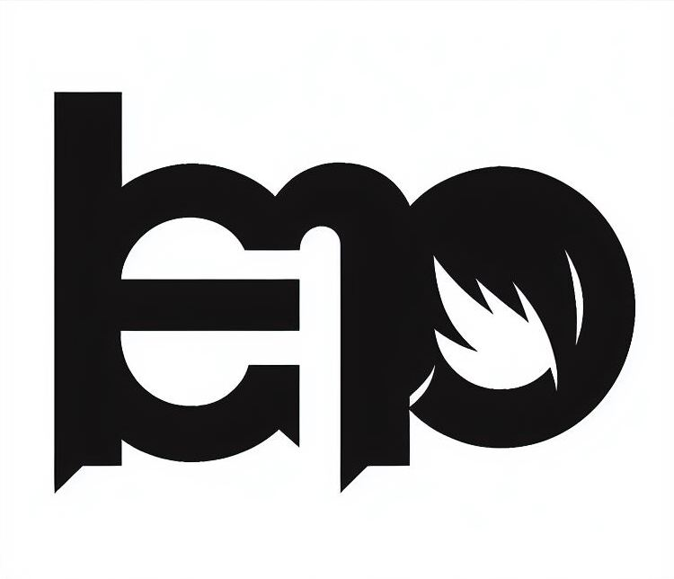
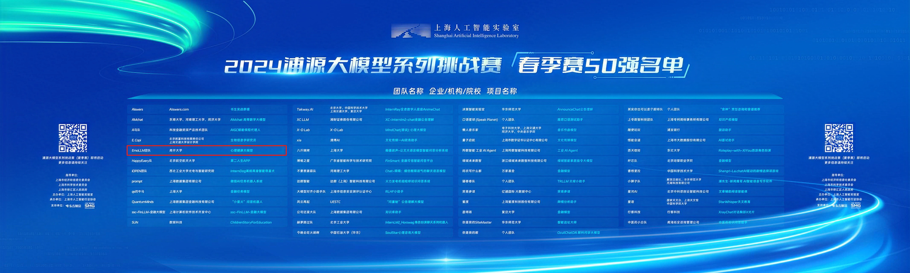

<div align="center"> 

# EmoLLM - Large Language Model for Mental Health

</div>

<p align="center">
  <a href="https://github.com/SmartFlowAI/EmoLLM/">
    
  </a>

<div align="center">

<!-- PROJECT SHIELDS -->
[![Contributors][contributors-shield]][contributors-url]
[![Forks][forks-shield]][forks-url]
[![Issues][issues-shield]][issues-url]
[![OpenXLab_App][OpenXLab_App-image]][OpenXLab_App-url]
[![OpenXLab_Model][OpenXLab_Model-image]][OpenXLab_Model-url] 
[![MIT License][license-shield]][license-url]
[![Stargazers][stars-shield]][stars-url]

</div>

<h3 align="center">EmoLLM</h3>

  <p align="center">
  <a href="README.md">简体中文</a> | English
    <br />
    <br />
    <a href="https://github.com/SmartFlowAI/EmoLLM"><strong>Explore the documentation of this project »</strong></a>
    <br />
    <br />
    <a href="https://openxlab.org.cn/apps/detail/Farewell1/EmoLLMV2.0">EmoLLM 2.0 Demo</a>
    ·
    <a href="https://github.com/SmartFlowAI/EmoLLM/issues">Report a Bug</a>
    ·
    <a href="https://github.com/SmartFlowAI/EmoLLM/issues">Propose a New Feature</a>
  </p>

</p>

<!-- 本篇README.md面向开发者 -->

**EmoLLM** is a series of large language models designed to understand, support and help customers in mental health counseling. It is fine-tuned from the LLM instructions. We really appreciate it if you could give it a star~⭐⭐. The open-sourced configuration is as follows:

<div align="center">

|         Model          |   Type   |
| :-------------------: | :------: |
|   InternLM2_7B_chat   |  QLORA   |
|   InternLM2_7B_chat   | full fine-tuning  |
|   InternLM2_7B_base   |   QLORA   |
|  InternLM2_1_8B_chat  | full fine-tuning  |
|  InternLM2_20B_chat  | LORA    |
|     Qwen_7b_chat      |   QLORA   |
|   Qwen1_5-0_5B-Chat   | full fine-tuning  |
|  Baichuan2_13B_chat   |   QLORA   |
|      ChatGLM3_6B      |   LORA    |
| DeepSeek MoE_16B_chat |  QLORA   |
| Mixtral 8x7B_instruct |  QLORA   |
|          ……           |    ……    |

</div>

Everyone is welcome to contribute to this project ~

---

The Model aims to fully understand and promote the mental health of individuals, groups, and society. This model typically includes the following key components:

-  Cognitive factors: Involving an individual's thought patterns, belief systems, cognitive biases, and problem-solving abilities. Cognitive factors significantly impact mental health as they affect how individuals interpret and respond to life events.
- Emotional factors: Including emotion regulation, emotional expression, and emotional experiences. Emotional health is a crucial part of mental health, involving how individuals manage and express their emotions and how they recover from negative emotions.
- Behavioral factors: Concerning an individual's behavior patterns, habits, and coping strategies. This includes stress management skills, social skills, and self-efficacy, which is the confidence in one's abilities.
- Social environment: Comprising external factors such as family, work, community, and cultural background, which have direct and indirect impacts on an individual's mental health.
- Physical health: There is a close relationship between physical and mental health. Good physical health can promote mental health and vice versa.
- Psychological resilience: Refers to an individual's ability to recover from adversity and adapt. Those with strong psychological resilience can bounce back from challenges and learn and grow from them.
- Prevention and intervention measures: The Mental Health Grand Model also includes strategies for preventing psychological issues and promoting mental health, such as psychological education, counseling, therapy, and social support systems.
- Assessment and diagnostic tools: Effective promotion of mental health requires scientific tools to assess individuals' psychological states and diagnose potential psychological issues.
### Recent Updates
- 【2024.3.12】 Released on Baidu Flying Pulp Platform [aiwei](https://aistudio.baidu.com/community/app/63335)
- 【2024.3.11】 **EmoLLM V2.0 is greatly improved in all scores compared to EmoLLM V1.0. Surpasses the performance of Role-playing ChatGPT on counseling tasks!** [Click to experience EmoLLM V2.0](https://openxlab.org.cn/apps/detail/Farewell1/EmoLLMV2.0), update [dataset statistics and details](./datasets/), [Roadmap](./assets/Roadmap_ZH.png)
- 【2024.3.9】 Add concurrency acceleration [QA pair generation](./scripts/qa_generation/), [RAG pipeline](./rag/)
- 【2024.3.3】 [Based on InternLM2-7B-chat full fine-tuned version EmoLLM V2.0 open sourced](https://openxlab.org.cn/models/detail/ajupyter/EmoLLM_internlm2_7b_full), need two A100*80G, update professional evaluation, see [evaluate](./evaluate/), update PaddleOCR-based PDF to txt tool scripts, see [scripts](./scripts/).
- 【2024.2.29】 Updated objective assessment calculations, see [evaluate](./evaluate/) for details. A series of datasets have also been updated, see [datasets](./datasets/) for details.
- 【2024.2.27】 Updated English README and a series of datasets (licking dogs and one-round dialogue)
- 【2024.2.23】The "Gentle Lady Psychologist Ai Wei" based on InternLM2_7B_chat_qlora was launched. [Click here to obtain the model weights](https://openxlab.org.cn/models/detail/ajupyter/EmoLLM_aiwei), [configuration file](xtuner_config/aiwei-internlm2_chat_7b_qlora.py), [online experience link](https://openxlab.org.cn/apps/detail/ajupyter/EmoLLM-aiwei)

- 【2024.2.23】Updated [several fine-tuning configurations](/xtuner_config/), added [data_pro.json](/datasets/data_pro.json) (more quantity, more comprehensive scenarios, richer content) and [aiwei.json](/datasets/aiwei.json) (dedicated to the gentle lady role-play, featuring Emoji expressions), the "Gentle Lady Psychologist Ai Wei" is coming soon.

- 【2024.2.18】 The full fine-tuned version based on Qwen1_5-0_5B-Chat has been [open-sourced](https://www.modelscope.cn/models/aJupyter/EmoLLM_Qwen1_5-0_5B-Chat_full_sft/summary). Friends with limited computational resources can now dive in and explore it.

<details>
<summary>View More</summary>

- 【2024.2.6】 [Open-sourced based on the Qwen1_5-0_5B-Chat full-scale fine-tuned version](https://www.modelscope.cn/models/aJupyter/EmoLLM_Qwen1_5-0_5B-Chat_full_sft/summary), friends with limited computing power can start experimenting~

<p align="center"> 
  
</p>

- 【2024.2.5】 The project has been promoted by the official WeChat account NLP Engineering. Here's the [link](https://mp.weixin.qq.com/s/78lrRl2tlXEKUfElnkVx4A) to the article. Welcome everyone to follow!! 🥳🥳

<p align="center">
  
</p>

- 【2024.2.3】 [Project Vedio](https://www.bilibili.com/video/BV1N7421N76X/) at bilibili 😊
- 【2024.1.27】 Complete data construction documentation, fine-tuning guide, deployment guide, Readme, and other related documents 👏
- 【2024.1.25】 EmoLLM V1.0 has deployed online https://openxlab.org.cn/apps/detail/jujimeizuo/EmoLLM 😀

</details>

### Honor

- The project won the ***top50*** in the **2024 Puyuan Large Model Series Challenge Spring Competition held by the Shanghai Artificial Intelligence Laboratory**

<p align="center">
   <a href="https://github.com/SmartFlowAI/EmoLLM/">
    
</p>

- The project has been promoted by the official WeChat account **NLP Engineering**. Here's the [link](https://mp.weixin.qq.com/s/78lrRl2tlXEKUfElnkVx4A). 

### Roadmap

<p align="center">
  <a href="https://github.com/SmartFlowAI/EmoLLM/">
    
  </a>

## Contents

- [EmoLLM - Large Language Model for Mental Health](#emollm---large-language-model-for-mental-health)
    - [Recent Updates](#recent-updates)
    - [Honor](#honor)
    - [Roadmap](#roadmap)
  - [Contents](#contents)
          - [Pre-development Configuration Requirements.](#pre-development-configuration-requirements)
          - [**User Guide**](#user-guide)
    - [File Directory Explanation](#file-directory-explanation)
    - [Data Construction](#data-construction)
    - [Fine-tuning Guide](#fine-tuning-guide)
    - [Deployment Guide](#deployment-guide)
    - [RAG (Retrieval Augmented Generation) Pipeline](#rag-retrieval-augmented-generation-pipeline)
    - [Frameworks Used](#frameworks-used)
      - [How to participate in this project](#how-to-participate-in-this-project)
    - [Version control](#version-control)
    - [Authors (in no particular order)](#authors-in-no-particular-order)
    - [Copyright Notice](#copyright-notice)
    - [Acknowledgments](#acknowledgments)
  - [Star History](#star-history)
  - [🌟 Contributors](#-contributors)
  - [Communication group](#communication-group)

###### Pre-development Configuration Requirements.

- A100 40G (specifically for InternLM2_7B_chat + qlora fine-tuning + deepspeed zero2 optimization)

###### **User Guide**

1. Clone the repo

```sh
git clone https://github.com/SmartFlowAI/EmoLLM.git
```

1. Read in sequence or read sections you're interested in：
   - [File Directory Explanation](#file-directory-explanation)
   - [Data Construction](#data-construction)
   - [Fine-tuning Guide](#fine-tuning-guide)
   - [Deployment Guide](#deployment-guide)
   - View More Details

### File Directory Explanation

```
├─assets: Image Resources
├─datasets: Dataset
├─demo: demo scripts
├─generate_data: Data Generation Guide
│  └─xinghuo
├─scripts: Some Available Tools
└─xtuner_config：Fine-tuning Guide
    └─images
```

### Data Construction

- Please read the [Data Construction Guide ](generate_data/tutorial.md)for reference.

- The dataset used for this fine-tuning can be found at [datasets](datasets/data.json)

### Fine-tuning Guide

For details, see the [fine-tuning guide](xtuner_config/README.md)

### Deployment Guide

- Demo deployment: see [deployment guide](./demo/README.md) for details.
- Quantitative deployment based on [LMDeploy](https://github.com/InternLM/lmdeploy/): see [deploy](./deploy/lmdeploy.md)

### RAG (Retrieval Augmented Generation) Pipeline

- See [RAG](./rag/)

<details>
<summary>Additional Details</summary>

### Frameworks Used

- [Xtuner](https://github.com/InternLM/xtuner)
- [Transformers](https://github.com/huggingface/transformers)
- [Pytorch](https://pytorch.org/)
- [LMDeploy](https://github.com/InternLM/lmdeploy/): for quantitative deployment
- [Stremlit](https://streamlit.io/): for building demos
- [DeepSpeed](https://github.com/microsoft/DeepSpeed): for parallel training
- …

#### How to participate in this project

Contributions make the open-source community an excellent place for learning, inspiration, and creation. Any contribution you make is greatly appreciated.

1. Fork the Project
2. Create your Feature Branch (`git checkout -b feature/AmazingFeature`)
3. Commit your Changes (`git commit -m 'Add some AmazingFeature'`)
4. Push to the Branch (`git push origin feature/AmazingFeature`)
5. Open a Pull Request

### Version control

This project uses Git for version control. You can see the currently available versions in the repository.

</details>

### Authors (in no particular order)

|                                Username                                 |                         School/Organization                          | Remarks |           Contributions            |
|:-----------------------------------------------------------------------:|:--------------------------------------------------------------------:| :------------------: |:----------------------------------:|
|                 [aJupyter](https://github.com/aJupyter)                 |                 Nankai University, Master's student                  | DataWhale member |         Project initiator          |
|                 [MING-ZCH](https://github.com/MING-ZCH)                 | Huazhong University of Science and Technology, Undergraduate student | LLM X Psychology researcher |         Project co-leader          |
|               [jujimeizuo](https://github.com/jujimeizuo)               |                Jiangnan University, Master's student                 |  |                                    |
|      [Smiling-Weeping-zhr](https://github.com/Smiling-Weeping-zhr)      |    Harbin Institute of Technology (Weihai), Undergraduate student    |  |                                    |
|                   [8baby8](https://github.com/8baby8)                   |              PaddlePaddle Pilot Team Regional Director               | Wenxin Large Model core developer |                                    |
|                   [zxazys](https://github.com/zxazys)                   |                 Nankai University, Master's student                  |  |                                    |
|         [JasonLLLLLLLLLLL](https://github.com/JasonLLLLLLLLLLL)         |       SWUFE (Southwestern University of Finance and Economics)       |  |                                    |
|                  [MrCatAI](https://github.com/MrCatAI)                  |                               AI Mover                               |  |                                    |
|                   [ZeyuBa](https://github.com/ZeyuBa)                   |              Institute of Automation, Master's student               |  |                                    |
|         [aiyinyuedejustin](https://github.com/aiyinyuedejustin)         |             University of Pennsylvania, Master's student             |  |                                    |
|                [Nobody-ML](https://github.com/Nobody-ML)                |  China University of Petroleum (East China), Undergraduate student   |  |                                    |
|                  [chg0901](https://github.com/chg0901)                  |          [MiniSora](https://github.com/mini-sora/minisora)           |Maintainer and Admin of [MiniSora](https://github.com/mini-sora/minisora) | LLM Fine-Tuning, Data Cleaning and Docs Translation |
|                   [Mxoder](https://github.com/Mxoder)                   |              Beihang University, Undergraduate student               |  |                                    |
|                 [Anooyman](https://github.com/Anooyman)                 |    Nanjing University of Science and Technology, Master's student    |  |                                    |
|               [Vicky-3021](https://github.com/Vicky-3021)               |        Xidian University, Master's student (Research Year 0)         |  |                                    |
|              [SantiagoTOP](https://github.com/santiagoTOP)              |          Taiyuan University of Technology, Master's student          | |                                    |
|              [zealot52099](https://github.com/zealot52099)              |                               AI Mover                               | |      Data Processing and RAG       |
|                  [wwwyfff](https://github.com/wwwyfff)                  |                  FuDan University, Master's student                  | ||
|                  [jkhumor](https://github.com/jkhumor)                  |                 Nankai University, Master's student                  | |                RAG                 |
|             [lll997150986](https://github.com/lll997150986)             |                 Nankai University, Master's student                  | |            Fine Tuning             |

### Copyright Notice

The project is licensed under the MIT License. Please refer to the details
 [LICENSE](https://github.com/SmartFlowAI/EmoLLM/blob/master/LICENSE)

### Acknowledgments

- [Sanbu](https://github.com/sanbuphy)
- [Shanghai Artificial Intelligence Laboratory](https://www.shlab.org.cn/)
- [Vanin](https://github.com/vansin)
- [Bloom up (WeChat Official Account Promotion)](https://mp.weixin.qq.com/s/78lrRl2tlXEKUfElnkVx4A)
- Abu (M.A. in Psychology, Peking University)

<!-- links -->

<!-- [linkedin-shield]: https://img.shields.io/badge/-LinkedIn-black.svg?style=flat-square&logo=linkedin&colorB=555 -->

<!-- [linkedin-url]: https://linkedin.com/in/aJupyter -->

<!-- 太少了，没必要放 -->

## Star History

[](https://star-history.com/#SmartFlowAI/EmoLLM&Date)

## 🌟 Contributors

[](https://github.com/SmartFlowAI/EmoLLM/graphs/contributors)

[your-project-path]: SmartflowAI/EmoLLM
[contributors-shield]: https://img.shields.io/github/contributors/SmartflowAI/EmoLLM.svg?style=flat-square
[contributors-url]: https://github.com/SmartflowAI/EmoLLM/graphs/contributors
[forks-shield]: https://img.shields.io/github/forks/SmartflowAI/EmoLLM.svg?style=flat-square
[forks-url]: https://github.com/SmartflowAI/EmoLLM/network/members
[stars-shield]: https://img.shields.io/github/stars/SmartflowAI/EmoLLM.svg?style=flat-square
[stars-url]: https://github.com/SmartflowAI/EmoLLM/stargazers
[issues-shield]: https://img.shields.io/github/issues/SmartflowAI/EmoLLM.svg?style=flat-square
[issues-url]: https://img.shields.io/github/issues/SmartflowAI/EmoLLM.svg
[license-shield]: https://img.shields.io/github/license/SmartflowAI/EmoLLM.svg?style=flat-square
[license-url]: https://github.com/SmartflowAI/EmoLLM/blob/main/LICENSE

[OpenXLab_App-image]: https://cdn-static.openxlab.org.cn/app-center/openxlab_app.svg
[OpenXLab_Model-image]: https://cdn-static.openxlab.org.cn/header/openxlab_models.svg
[OpenXLab_App-url]: https://openxlab.org.cn/apps/detail/Farewell1/EmoLLMV2.0
[OpenXLab_Model-url]: https://openxlab.org.cn/models/detail/ajupyter/EmoLLM_internlm2_7b_full

## Communication group

- If it fails, go to the Issue section.

<p align="center">
  
</p>
