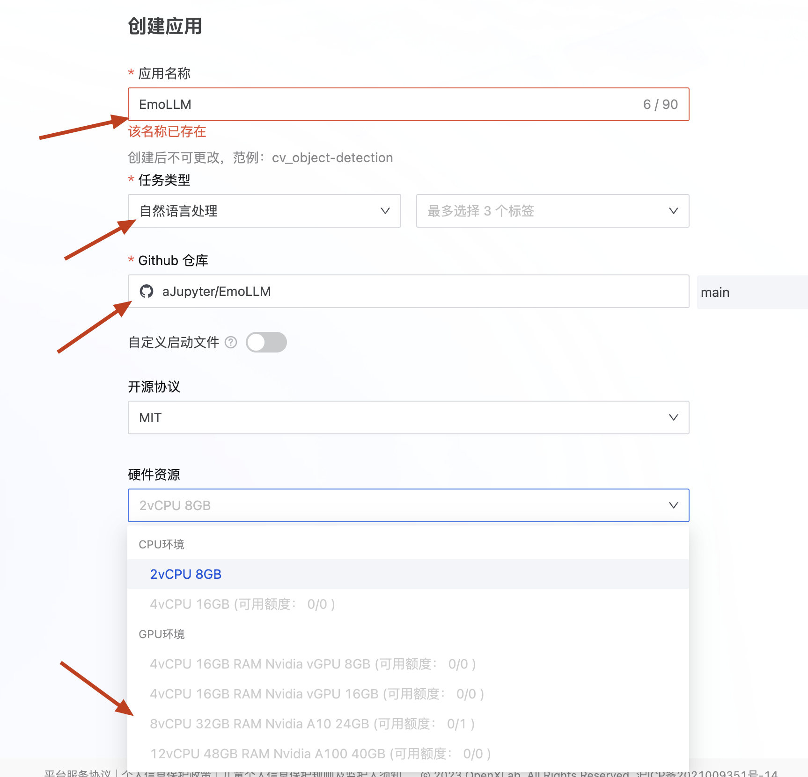
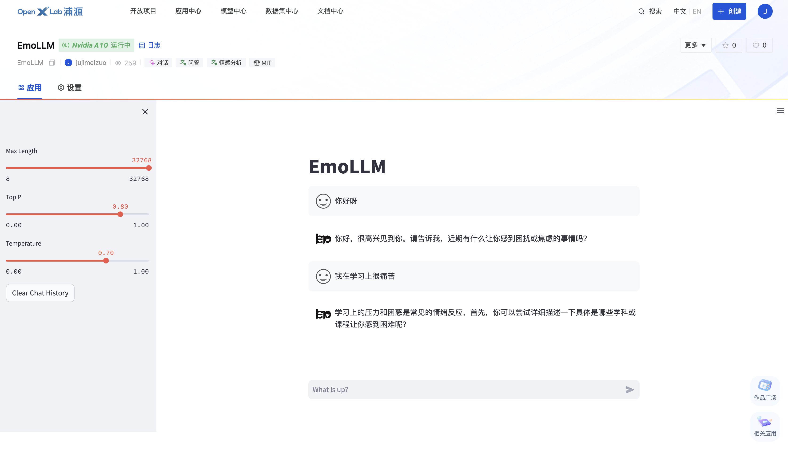

# Deploying Guide for EmoLLM

## Local Deployment
- Please read [Quick Start](../docs/quick_start_EN.md) to see.

## Deploy on OpenXLab

- Log in to OpenXLab and create a Gradio application

- Select configurations and create the project

- Wait for the build and startup

- Try your own project

