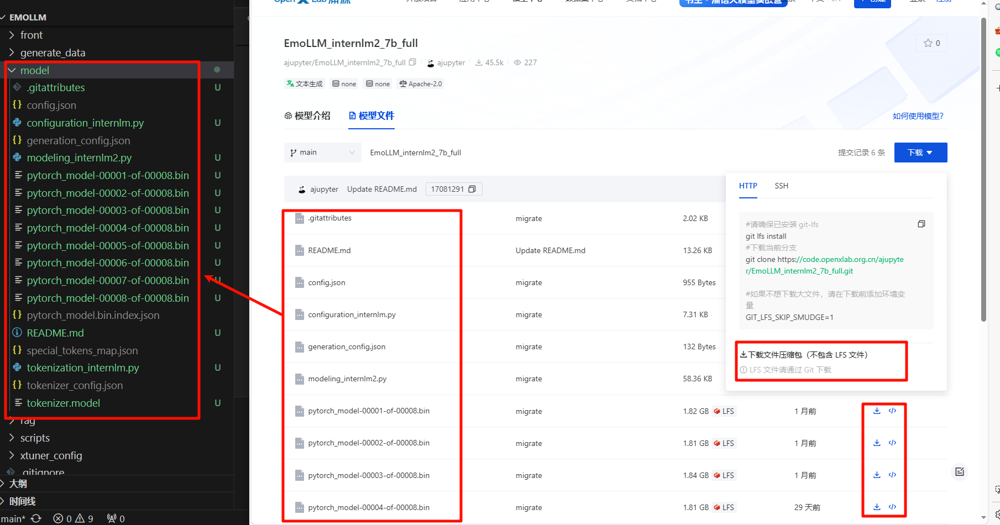

### 1. Deployment Environment
- Operating system: Ubuntu 22.04.4 LTS
- CPU: Intel (R) Xeon (R) CPU E 5-2650, 32G
- Graphics card: NVIDIA RTX 4060Ti 16G, NVIDIA-SMI 535.104.05  Driver Version: 535.104.05  CUDA Version: 12.2
- Python 3.11.5

### 2. Default Deployment Steps
- 1. Clone the code or manually download the code and place it on the server:
```
git clone https://github.com/SmartFlowAI/EmoLLM.git
```
- 2. Install Python dependencies:
```
# cd EmoLLM
# pip install -r requirements.txt
```
- 3. Download the model files, either manually or by running the download_model.py script.
- 3.1. Automatically download the model file and run the script:
```
# python download_model.py <model_repo>

# Run the web_demo-aiwei.py script to run the model repository at ajupyter/EmoLLM_aiwei, ie:
# python download_model.py ajupyter/EmoLLM_aiwei

# Run the web_internlm2.py script to run the model repository at jujimeizuo/EmoLLM_Mode, ie:
# python download_model.py jujimeizuo/EmoLLM_Model

# This script can also be used to automatically download other models. This script only supports automatic download of models from openxlab platform, models from other platforms need to be downloaded manually. After successful download, you can see a new model directory under EmoLLM directory, i.e. the model file directory.
```
- 3.2. To download the model file directory manually, go to openxlab, Huggingface, etc. to download the complete model directory file, and put all the files in the `EmoLLM/model` directory. Note that the LFS file (e.g. pytorch_model-00001-of-00008.bin) is not downloaded when the model file directory is packaged for download, so you need to download the full LFS file one by one.

- 4. Run the script, app.py is only used to call web_demo-aiwei.py or web_internlm2.py file, you can download the model file of the corresponding script for whichever script you want to run, and then comment the other script in app.py. Then run the script:
```
python app.py
```
- 5. After running app.py, you can access the model's web page through your browser at the following address: http://0.0.0.0:7860. You can modify the app.py file to change the web page access port to experience the model normally. If you are deploying on a server, you need to configure local port mapping.
- 6. Use of other models,  EmoLLM offers several versions of the open source model, uploaded to openxlab、Huggingface, and other platforms. There are roles such as the [father's boyfriend counselor](https://openxlab.org.cn/models/detail/chg0901/EmoLLM_Daddy-like_BF), [the old mother's counselor](https://huggingface.co/brycewang2018/EmoLLM-mother/tree/main), and [the gentle royal psychiatrist](https://openxlab.org.cn/models/detail/ajupyter/EmoLLM_aiwei). There are several models to choose from such as EmoLLM_internlm2_7b_full, EmoLLM-InternLM7B-base-10e and so on. Repeat steps 3 and 4 to manually or automatically download the model in the `EmoLLM/model` directory and run the experience.