# 封面

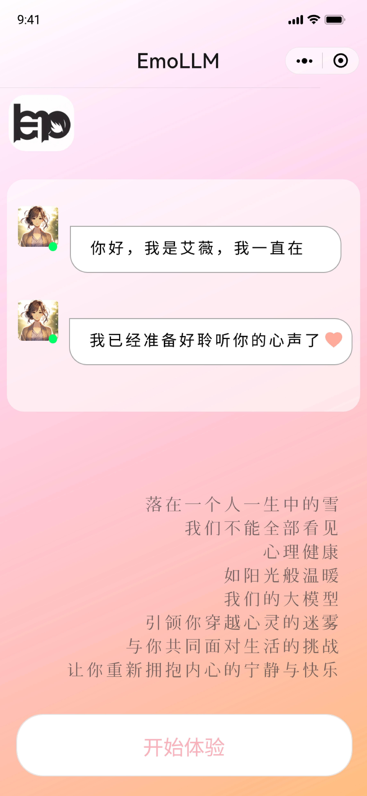

# 新用户登录注册页面

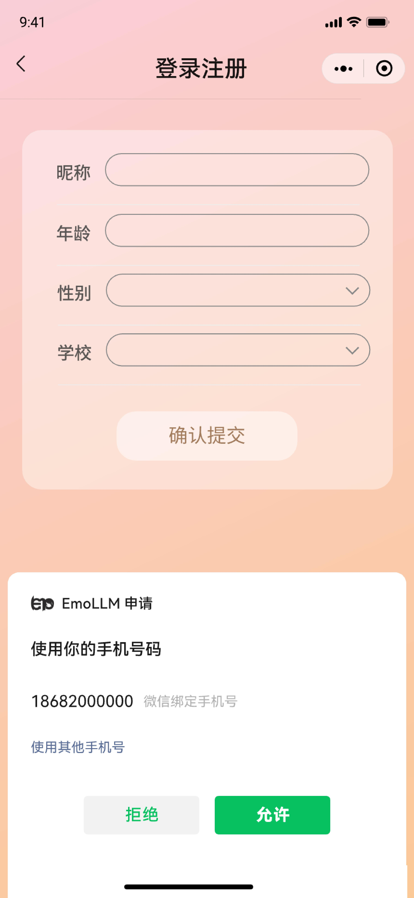

# 首页/模式选择页面

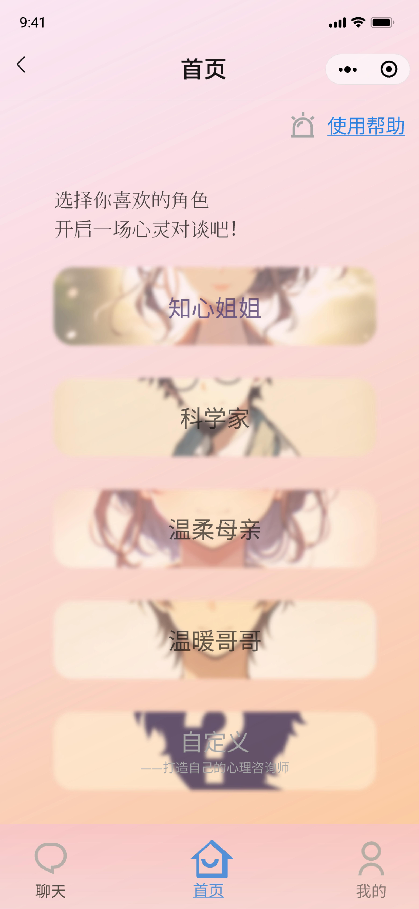

## 使用帮助页面

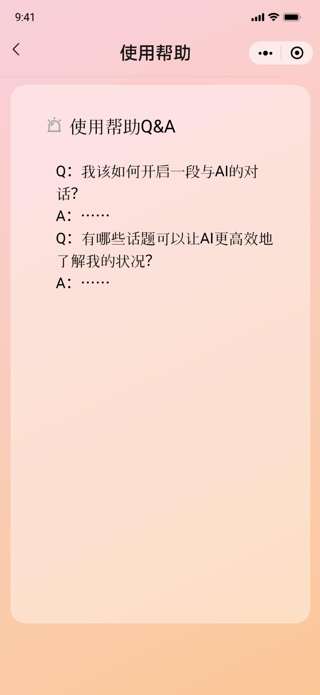

## 知心姐姐对话页面

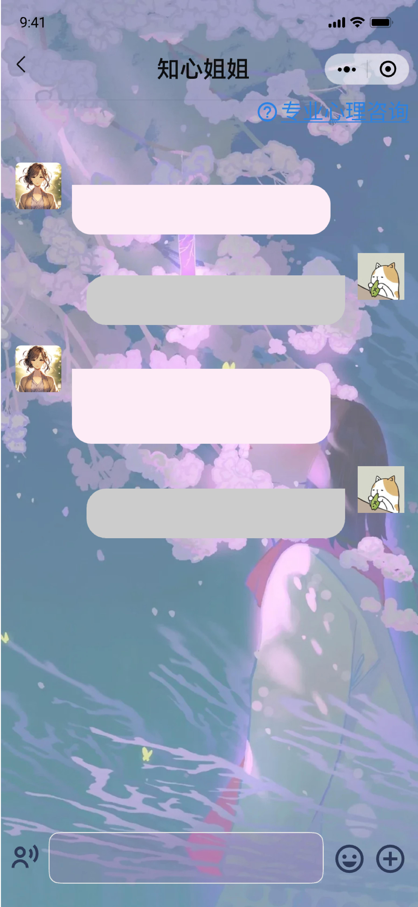

## 科学家对话页面

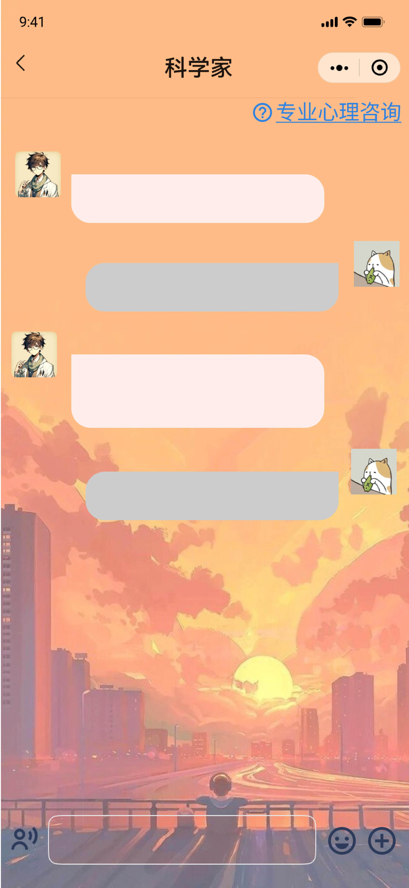

## 温柔母亲对话页面

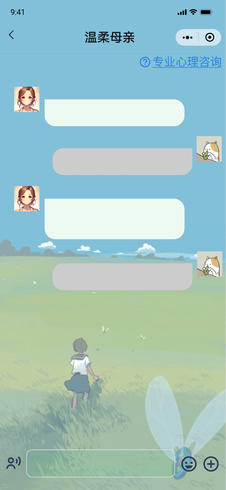

## 温暖哥哥对话页面

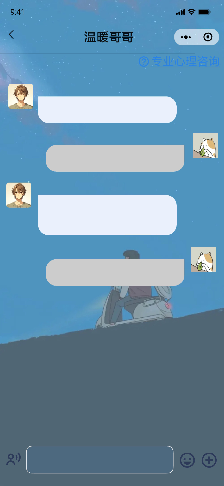

## 自定义角色页面

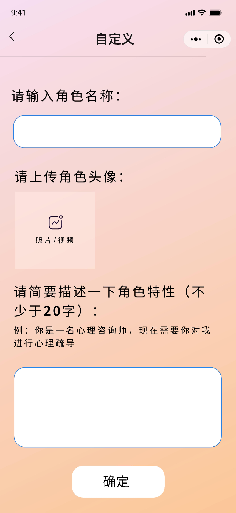

## 自定义角色对话页面

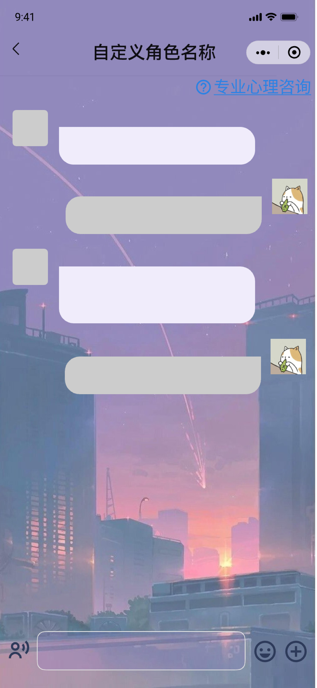

# 聊天个性化设置（以知心姐姐为例）

# 校内咨询通道

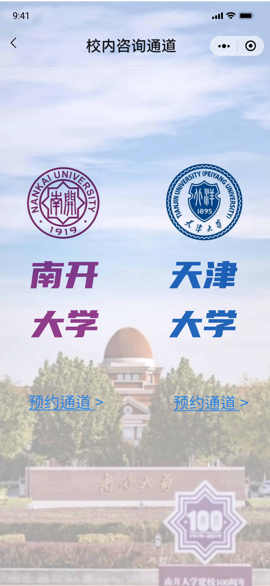

​                                                                                                                                                                                                                                                                                                                                                                                                                                                                                                                                                                                                                                                                                                                                                                                                                                                                                                                                                                                                                                                                                                                                                                                                                                                                                                                                                                                                                                                                                                                                                                                                                                                                                                                                                                                                                                                                                                                                                                                                                                                                                                                                                                                                                                                                                                                                                                                                                                                                                                                                                                                                                                                                                                                                                                                                                                                                                                                                                                                                                                                                                                                                                                                                                                                                                                                                                                                                                                                                                                                                                                                                                                                                                                                                                                                                                                                                                                                                                                                                                                                                                                                                                                                                                                        

# 聊天会话页面

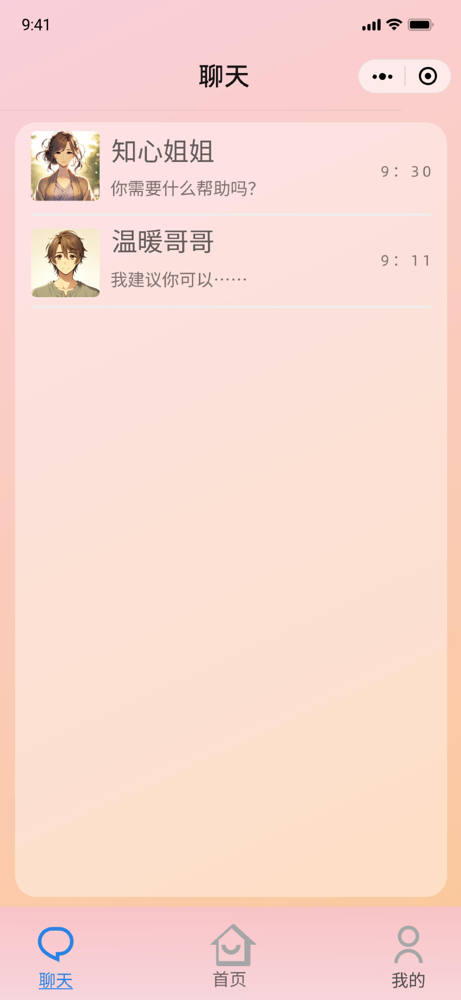

# 我的

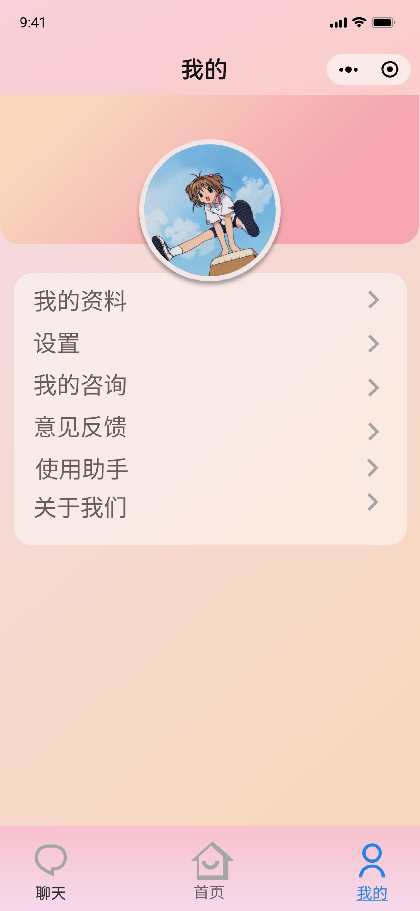

# 意见反馈页面

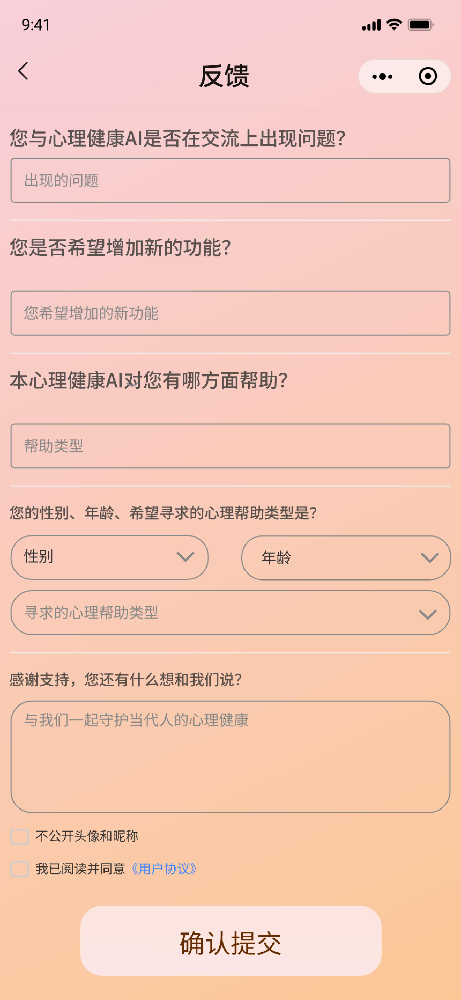