# 模型上传指南

## OpenXLab浦源平台

### OpenXLab平台介绍

<div align="center">
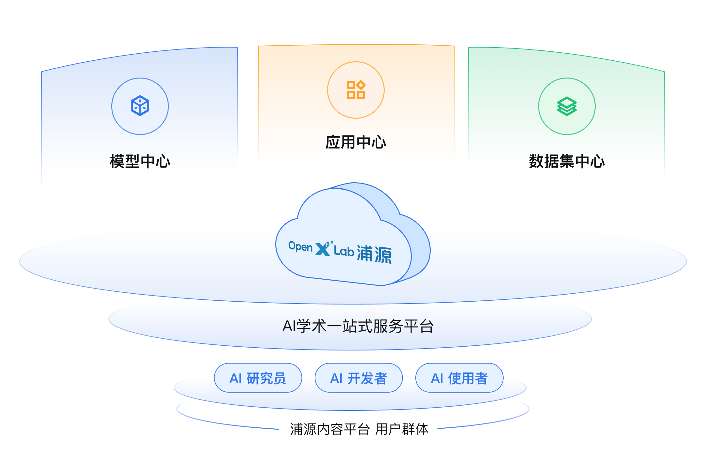
  <div align="center">
  </div>
</div>

OpenXLab浦源 内容平台 是面向 AI 研究员和开发者提供 AI 领域的一站式服务平台，包含数据集中心、模型中心和应用中心。内容平台为 AI 研究员和开发者提供了所需的模型训练物料，同时也为他们提供了模型推理应用的托管服务。此外，内容平台致力于打造一个 AI 数据集、模型与应用的交流社区，为 AI 研究者提供一个分享和交流的平台。通过内容平台，AI 研究者可以更好地展示自己的模型能力，并激发创造力，助力 AI 生态的可持续发展。

更多介绍请查看[OpenXLab浦源平台介绍](https://openxlab.org.cn/docs/intro.html)

<!-- ​ 应用中心：应用中心提供应用托管的服务，用户只需遵循平台规范，通过简单的前端封装组件（Gradio）即可构建模型推理应用演示 demo，应用中心提供免费应用部署的能力，普通用户也可在应用中心中交互式体验模型的能力，更好帮助用户寻找想要的学术模型或应用服务。通过前端封装组件和平台的 SDK 工具，帮助 AI 开发者简单快速构建人工智能应用。

​ 模型中心：支持丰富模型管理方式，模型中心基于模型元信息标准规范，支持用户上传、存储、检索、评测各类模型。基于平台内的命令行工具，便于 AI 开发者上传和发布模型文件，搭建对象存储体系，提供大文件存储能力，快速上传下载功能，便于 AI 开发者进行模型存储。

​ 数据集中心：支持多元数据管理，数据中心提供公开数据集的展示、检索和下载等，同时提供私有数据集的上传、管理和发布功能，支持用户自建数据集的开放共享。数据集中心为人工智能研究者提供免费开源的数据集，通过数据集中心，研究者可以获得格式统一的各领域经典数据集。通过平台的搜索功能，研究者可以迅速便捷地找到自己所需数据集；通过平台的统一格式，研究者可以便捷地对跨数据集任务进行开发。

<div align="center">
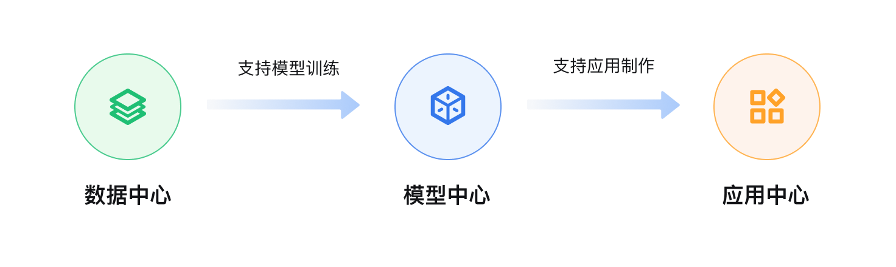
  <div align="center">
  </div>
</div>

内容平台中，模型仓库存储模型相关的权重文件，应用仓库管理部署应用，为了简化贡献者的维护成本，模型相关的算法训练代码和应用的相关代码托管至 GitHub 中，即 GitHub 中可以存放算法训练的代码和应用相关的代码，贡献者只需维护 GitHub 仓库代码即可，无需多方维护代码，内容平台只提供模型权重的存储服务和应用的部署服务。

<div align="center">
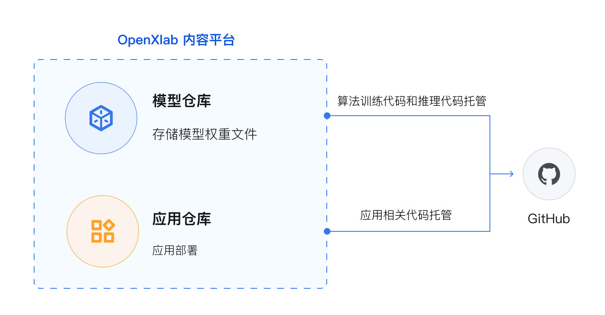
  <div align="center">
  </div>
</div> -->

## 模型创建流程

### 要点强调

- 浦源-模型中心提供目前支持通过Git命令进行文件上传
- 使用该方法进行文件上传前，请您确认已安装Git
- 由于上传需要进行权限校验，这里我们推荐使用VSCode远程ssh连接InternLM AI Studio, 获取XLab秘钥

### 创建具体步骤

- 步骤1：点击“创建模型”按钮
- 步骤2：填写仓库相关信息
- **步骤3：上传模型相关文件**

更多详情和操作步骤请查看, 请参考[**模型创建流程**(步骤1和2)](https://openxlab.org.cn/docs/models/%E6%A8%A1%E5%9E%8B%E5%88%9B%E5%BB%BA%E6%B5%81%E7%A8%8B.html)和[**上传模型**(步骤3)](https://openxlab.org.cn/docs/models/%E4%B8%8A%E4%BC%A0%E6%A8%A1%E5%9E%8B.html), 这里我们将给出所用到的基本步骤和需要注意的操作要点.

## 上传模型

### 上传具体步骤

- **步骤1：安装git lfs**
- **步骤2：配置git和lfs**
- **步骤3：配置OpenXLab秘钥**
- 步骤4：在本地的文件夹内调整文件
- 步骤5：上传本地文件夹中的模型文件到OpenXLab
- 步骤6：上传后查看和添加README.md

这里展示最顺利的截图

<div align="center">
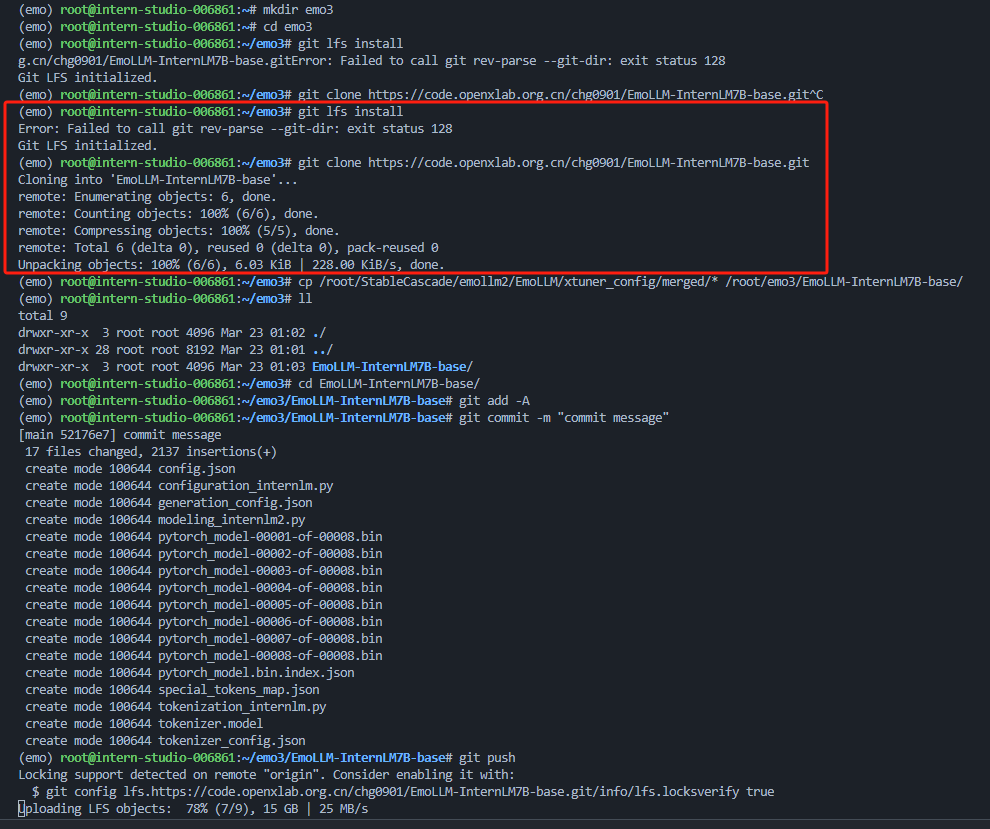
  <div align="center">
  </div>
</div>

### 1. 安装git lfs

```bash
# 更好的方法
conda install git-lfs

# 旧方法
# curl -s https://packagecloud.io/install/repositories/github/git-lfs/script.deb.sh
# apt install git-lfs
```

### 2. 配置git和lfs

```bash
git lfs install # 这个很关键
git clone https://code.openxlab.org.cn//chg0901/EmoLLM-InternLM7B-base.git  # 要上传的模型链接, 由步骤1和2创建
```

`git lfs install`会出现一个Error，请忽略，这是因为这条命令执行的

### 3. 配置OpenXLab秘钥

- 详情请参考[**密钥管理**](https://openxlab.org.cn/security?tab=git), 获取您的 Git Access Token
- 点击 “**添加令牌**” 按钮
- 由于后续需要进行文件上传，所以请您在新建token时，选择 **“可写” 权限**
- **注意：**最好是**重新创建**一个**新的令牌**，*旧的令牌*可能会导致***上传权限失败***

<div align="center">
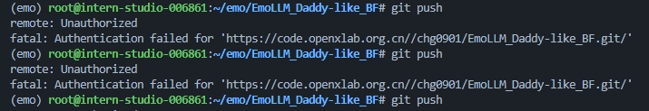
  <div align="center">
  </div>
</div>

### 4. 在本地的文件夹内调整文件（文件夹名同仓库同名）和配置Git信息

将merge后的模型文件复制到git clone后的文件夹中

```bash
cd ./merge  #  merge目录下为合并后的模型
cp ./* /root/EmoLLM-InternLM7B-base/  # 复制模型到clone后的文件夹

# 配置Git信息
git config --global user.email "your email"
git config --global user.name "your OpenXLab id"  # OpenXLab id
git config --global user.password "your new key"  # 新的OpenXLab秘钥

```

### 5. 上传本地文件夹中的模型文件到OpenXLab

```bash
git add -A
git commit -m "commit EmoLLM-InternLM7B-base"
git push
```

push的时候, 需要填写username和password三次,

<div align="center">
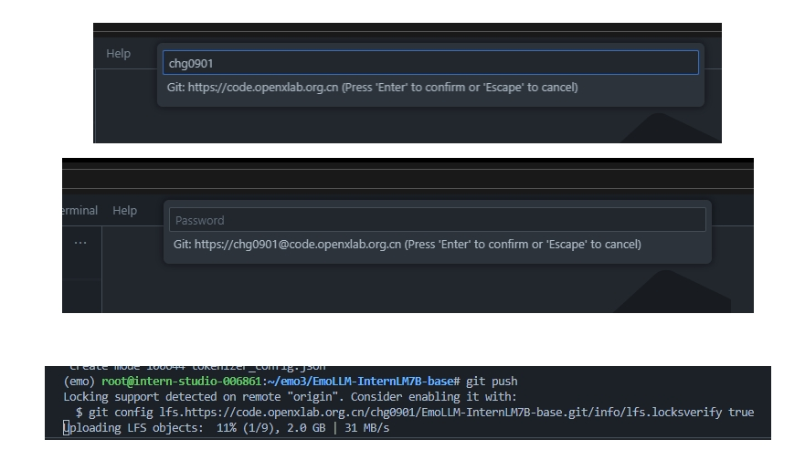
  <div align="center">
  </div>
</div>

### 6. 上传后查看和添加README.md

上传完模型, 还可以复制之前上传的`README.md`文件到自己的仓库中.

处理完之后, 就可以看到自己的模型Repo了.

<div align="center">
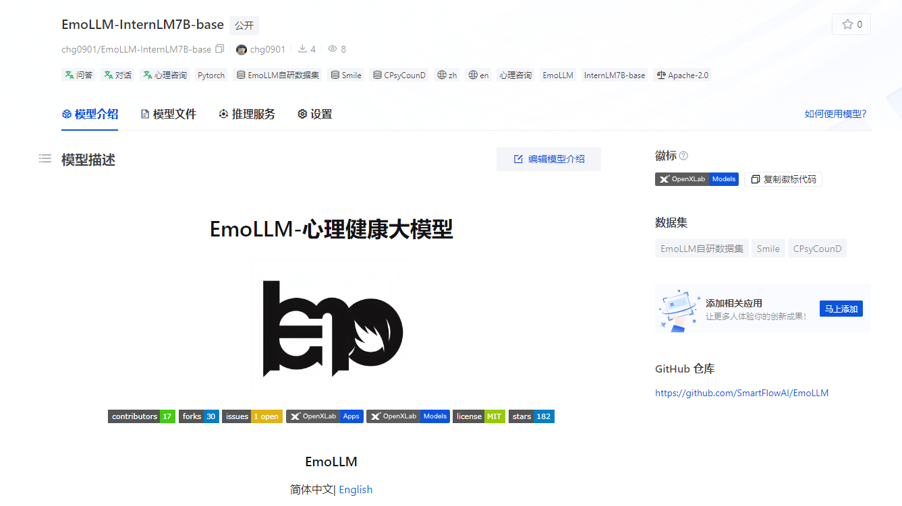
  <div align="center">
  </div>
</div>

<div align="center">
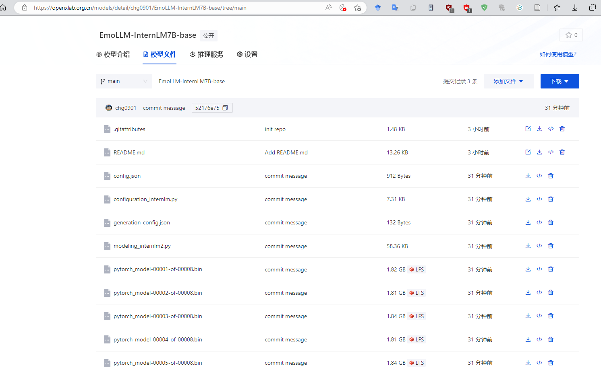
  <div align="center">
  </div>
</div>

### 可能遇到的问题

可以查看下面的截图, 查看bug和解决方法以及所用的bash命令. 

出现这个问题的原因是因为上传不成功或者上传被打断.

<div align="center">
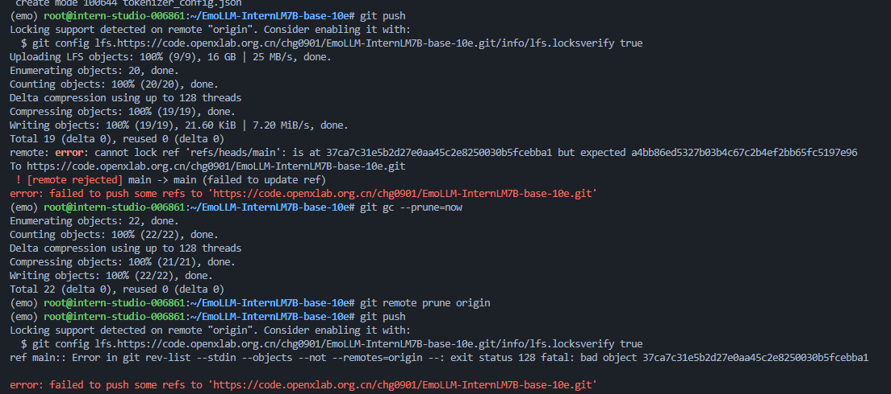
  <div align="center">
  </div>
</div>

<div align="center">
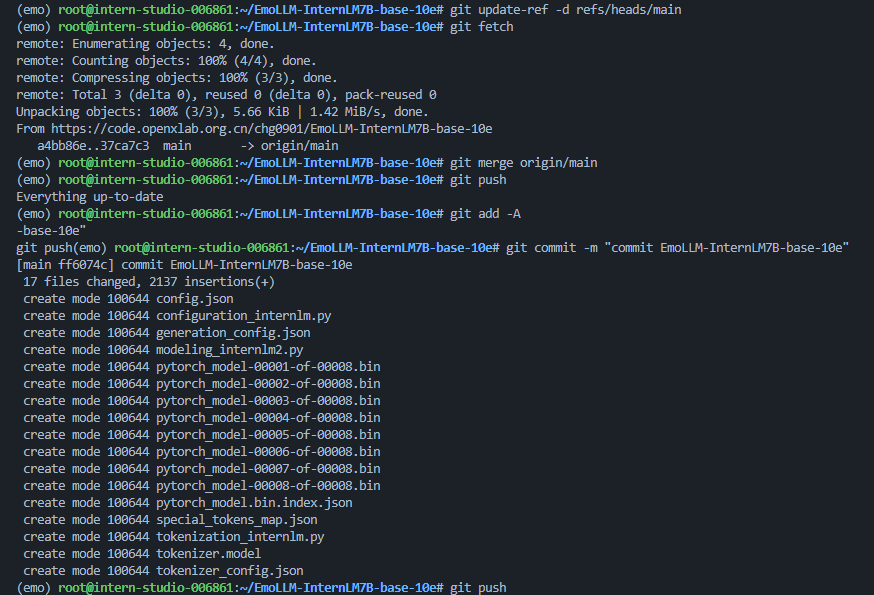
  <div align="center">
  </div>
</div>

<div align="center">
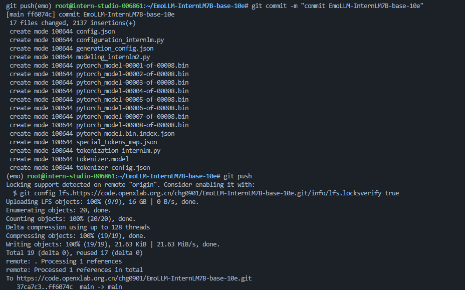
  <div align="center">
  </div>
</div>

bash命令如下:

```bash
git add -A
git commit -m "commit EmoLLM-InternLM7B-base"
git push  # 出现error

# solution1
git gc --prune=now
git remote prune origin
git push

# solution2 (可能solution1无效)
git update-ref -d refs/heads/main
git fetch
git merge origin/main

# error 解决, 重新上传
git push
git commit -m "commit EmoLLM-InternLM7B-base"
git push
```

## ModelScope

### ModelScope平台介绍

ModelScope旨在打造下一代开源的模型即服务共享平台，为泛AI开发者提供灵活、易用、低成本的一站式模型服务产品，让模型应用更简单！

我们希望在汇集行业领先的预训练模型，减少开发者的重复研发成本，提供更加绿色环保、开源开放的AI开发环境和模型服务，助力绿色“数字经济”事业的建设。
ModelScope平台将以开源的方式提供多类优质模型，开发者可在平台上免费体验与下载使用。

### 模型创建

ModelScope平台内的模型创建和OpenXLab, 这里不再赘述, 可以点击[ModelScope模型创建链接地址](https://modelscope.cn/models/create)自行填写.

<div align="center">
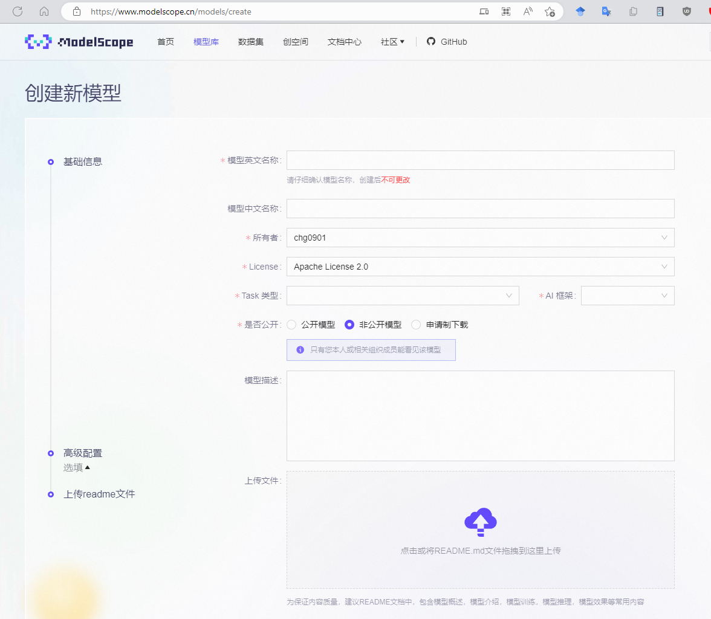
  <div align="center">
  </div>
</div>

<div align="center">
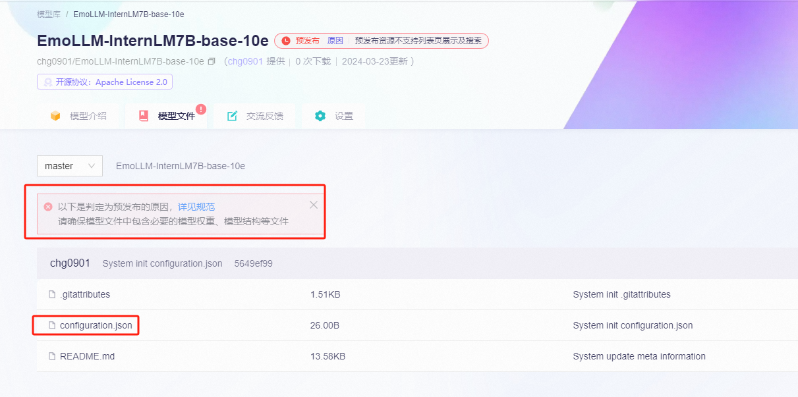
  <div align="center">
  </div>
</div>

### 使用Python SDK上传模型

可以使用modelscope HubApi来将已经训练好的模型上传到ModelScope平台,

ModelScope的上传比OpenXLab简单不少, 在ModelScope社区网页创建对应模型之后，只需要**配置访问令牌(请从ModelScope`个人中心->访问令牌获取`)**, 然后将本地模型目录通过push_model接口进行上传即可.

需要注意的是, **ModelScope要求上传的模型目录含有`configuration.json`文件**, 我们训练的merge模型目录只有`config.json`, 因此可以复制这个文件然后修改文件名即可.

```python
from modelscope.hub.api import HubApi

YOUR_ACCESS_TOKEN = '请从ModelScope个人中心->访问令牌获取(SDK 令牌)'

api = HubApi()
api.login(YOUR_ACCESS_TOKEN)
api.push_model(
    model_id="your_name/your_model_id", 
    model_dir="your_model_model_dir" # 本地模型目录，要求目录中必须包含configuration.json
)
```

<div align="center">
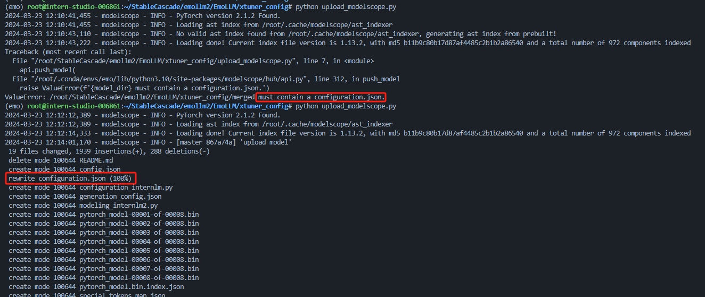
  <div align="center">
  </div>
</div>
