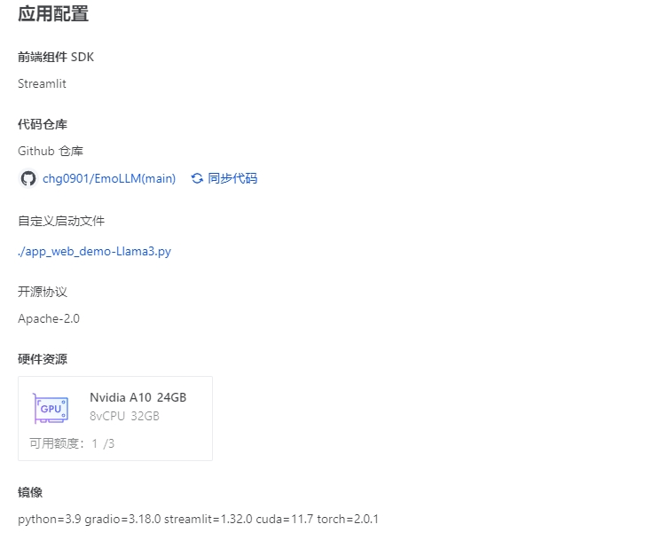

# Llama-3-8B-Instruct QLoRA 快速微调指南

本文将从以下几个方面来介绍**Llama3的下载和使用**，**在EmoLLM项目上进行基于Xtuner微调**。

- Huggingface上Llama3模型使用申请
- 实验环境搭建
- 下载LLama3模型和github安装
- 下载和安装Xtuner
- 修改Xtuner模型配置文件
- 在EmoLLM项目上进行基于Xtuner进行QLoRA微调

## 更新

|         模型          |训练方式|                                                   链接                                                   | 模型链接   |
| :-------------------: | :----------: | :------------------------------------------------------------------------------------------------------: |:------: |
| LLaMA3_8b_instruct2.0 |  QLORA   | [llama3_8b_instruct_qlora_alpaca_e3_M.py](./xtuner_config/llama3_8b_instruct_qlora_alpaca_e3_M.py)    |[OpenXLab](https://openxlab.org.cn/models/detail/chg0901/EmoLLM-Llama3-8B-Instruct2.0), [ModelScope](https://modelscope.cn/models/chg0901/EmoLLM-Llama3-8B-Instruct2.0/summary) |
| LLaMA3_8b_instruct3.0 |  QLORA   | [llama3_8b_instruct_qlora_alpaca_e3_M_ruozhi_scM.py](./llama3_8b_instruct_qlora_alpaca_e3_M_ruozhi_scM.py)    |[OpenXLab](https://openxlab.org.cn/models/detail/chg0901/EmoLLM-Llama3-8B-Instruct3.0), [ModelScope](https://modelscope.cn/models/chg0901/EmoLLM-Llama3-8B-Instruct3.0/summary) |

已经上传了最新的训练配置文件, 进行了些许改动, 训练数据中添加了85条自我认知数据和240条弱智吧数据.

### 简评

Llama3 由于中文训练数据较少，因此微调后，部分中文逻辑能力会稍弱一些，后续会继续更新对基于中文对齐后的Llama3模型的EmoLLM模型微调训练。

### 更新的文件

- 原始自我认知数据 [**self_cognition_EmoLLM.json**](../datasets/self_cognition_EmoLLM.json) (修改自[ChatGLM-Efficient-Tuning](https://github.com/hiyouga/ChatGLM-Efficient-Tuning/blob/main/data/self_cognition.json))
- 处理后的符合对话格式的自我认知数据 [**processed_self_cognition_EmoLLM.json**](../datasets/processed/processed_self_cognition_EmoLLM.json)
- 配置文件 [llama3_8b_instruct_qlora_alpaca_e3_M_ruozhi_scM.py](./llama3_8b_instruct_qlora_alpaca_e3_M_ruozhi_scM.py)
- 弱智吧原始数据 [**ruozhiba_raw.jsonl**](../datasets/ruozhiba_raw.jsonl)
- 弱智吧原始数据的Python处理文件 [**ruozhiba_raw_data_process.py**](../datasets/ruozhiba_raw_data_process.py)
- ruozhiba_raw_data_process.py处理之后的弱智吧数据 [**ruozhiba_format_emo.jsonl**](../datasets/processed/ruozhiba_format_emo.jsonl)
- 数据集划分工具代码 [**split_dataset.py**](../datasets/split_dataset.py)
- 调用split_dataset.py的示例代码 [**split_shuffle.py**](../datasets/split_shuffle.py)
- [](https://openxlab.org.cn/apps/detail/chg0901/EmoLLM-Llama3-8B-Instruct3.0) **OpenXLab**部署文件及说明  
  - 目前OpenXLab采用了新的模型下载方式
  
  ```Python
  base_path = './EmoLLM-Llama3-8B-Instruct3.0'
  os.system(f'git clone https://code.openxlab.org.cn/chg0901/EmoLLM-Llama3-8B-Instruct3.0.git {base_path}')
  os.system(f'cd {base_path} && git lfs pull')
  ```

  - 启动文件 [app_web_demo-Llama3.py](../app_web_demo-Llama3.py)
  - git lfs 依赖文件 [packages.txt](../packages.txt)
  - 部署时注意其他设置和具体细节，请参照[openxlab-deploy](https://github.com/InternLM/Tutorial/tree/camp2/tools/openxlab-deploy)
  
  - 在线体验链接 [EmoLLM Llama3心理咨询室V3.0](https://st-app-center-006861-9746-jlroxvg.openxlab.space/) ，或者前往[OpenXLab EmoLLM3.0-Llama3](https://openxlab.org.cn/apps/detail/chg0901/EmoLLM-Llama3-8B-Instruct3.0)启动

### 更新的有关参考教程

请参考以下知乎链接进行训练和测评

- [[Llama3][InternLM2][RuoZhiBa][EmoLLM]**使用弱智吧数据微调Llama3-Instruct-8B模型**](https://zhuanlan.zhihu.com/p/694818596)
- [[Llama3][EmoLLM][Minisora]**Meta Llama 3快速上手：用EmoLLM数据基于Xtuner采用QLoRA微调Meta-Llama-3-8B-Instruct模型**【V1】](https://zhuanlan.zhihu.com/p/693454096)
- [[Llama3][InternLM2]**OpenCompass 大模型评测Llama3-instruct-8B有关模型**](https://zhuanlan.zhihu.com/p/694922988)

## 模型和有关GitHub项目下载

### Llama-3-8B-Instruct模型下载

我们这里采用的是Meta-Llama-3-8B-Instruct模型

该模型已经**针对指令和任务数据集**进行了 fine-tuning，使其更适合**需要遵循指令或完成任务的应用场景**。(The "Instruct" suffix indicates that this model has been fine-tuned on a dataset of instructions and tasks, making it more suitable for applications that require following instructions or completing tasks.)

```python
from modelscope import snapshot_download

model_dir = snapshot_download('LLM-Research/Meta-Llama-3-8B-Instruct')
print(model_dir)
```


## 实验环境搭建

### 建议新建环境

```bash
conda create -n llama python=3.10
```

### pytorch安装

```python
# CUDA 12.1
conda install pytorch==2.1.0 torchvision==0.16.0 torchaudio==2.1.0 pytorch-cuda=12.1 -c pytorch -c nvidia
```

### git clone XTuner-0.1.18

```python
git clone https://github.com/InternLM/xtuner
```

查看更新的`/root/xtuner/xtuner/utils/templates.py`中`llama3_chat`的模板

```python
llama3_chat=dict(
    SYSTEM=('<|start_header_id|>system<|end_header_id|>\n\n'
            '{system}<|eot_id|>'),
    INSTRUCTION=(
        '<|start_header_id|>user<|end_header_id|>\n\n{input}<|eot_id|>'
        '<|start_header_id|>assistant<|end_header_id|>\n\n'),
    SUFFIX='<|eot_id|>',
    SUFFIX_AS_EOS=True,
    STOP_WORDS=['<|eot_id|>']),
```

- 微调模型是为对话应用训练的。
- 为了获得它们的预期特性和性能，需要遵循 [ChatFormat](https://github.com/meta-llama/llama3/blob/main/llama/tokenizer.py#L202) 中定义的特定格式：
  1. 提示以特殊令牌 `<|begin_of_text|>` 开始，之后跟随一个或多个消息。
  2. 每条消息以标签 `<|start_header_id|>` 开始，角色为 `system`、`user` 或 `assistant`，并以标签 `<|end_header_id|>` 结束。
  3. 在双换行 `\n\n` 之后，消息的内容随之而来。每条消息的结尾由 `<|eot_id|>` 令牌标记。
- Ref： [ArtificialZeng/llama3_explained](https://github.com/ArtificialZeng/llama3_explained)

### 安装XTuner-0.1.18

```python
# 进入源码目录
cd /root/xtuner/xtuner

# 从源码安装 XTuner
pip install -e '.[all]'
```


## 配置文件和参数调整

### 修改配置文件

我们这里可以参照[EmoLLM](https://link.zhihu.com/?target=https%3A//github.com/SmartFlowAI/EmoLLM)的[README_internlm2_7b_base_qlora.md](xtuner_config/README_internlm2_7b_base_qlora.md)来进行修改
这里主要修改模型路径`pretrained_model_name_or_path` 和对话模板`prompt_template` ，将我们下载的Llama模型路径`Meta-Llama-3-8B-Instruct`和修改后的对话模板`llama3_chatM` 改到对应的位置即可

```python
# pretrained_model_name_or_path = '/root/share/model_repos/internlm2-chat-7b'
pretrained_model_name_or_path = '/root/models/LLM-Research/Meta-Llama-3-8B-Instruct'


# prompt_template = PROMPT_TEMPLATE.internlm2_chat  # there is No internlm2_base
prompt_template = PROMPT_TEMPLATE.llama3_chatM  # there is No internlm2_base


# alpaca_en_path = 'tatsu-lab/alpaca'
# alpaca_en = dict(
#    type=process_hf_dataset,
#    dataset=dict(type=load_dataset, path=alpaca_en_path),）

data_path = '../datasets/multi_turn_dataset_2.json'
alpaca_en = dict(
    type=process_hf_dataset,
    dataset=dict(type=load_dataset, path='json', data_files=dict(train=data_path)),）

    # configure default hooks
    default_hooks = dict(
        # save checkpoint per `save_steps`.
        checkpoint=dict(
            type=CheckpointHook,

            # by_epoch=False,
            # interval=save_steps,
            interval=1,

            max_keep_ckpts=save_total_limit),
    )
```

### 根据硬件配置调整参数

除修改模型路径和对话模板之外，还需要根据自己的GPU硬件配置来调整一下有关参数


这里还有个问题，就是需要**设置下环境变量**`PYTORCH_CUDA_ALLOC_CON`，来更好的利用所有的**GPU显存**

```python
export 'PYTORCH_CUDA_ALLOC_CONF=max_split_size_mb:256'
```

采用以下的配置，可以使单张A100基本跑满

```python
max_length = 2048
batch_size = 16 # per_device
accumulative_counts = 1
max_epochs = 3
lr = 1e-4
evaluation_freq = 500
```

还有一个需要和匹配的是model.lora中的r和lora_alpha参数，也需要根据自己的硬件环境来调整

```python
r=32,
lora_alpha=64,
```

### 添加中文回答prompt

更重要的是，**Llama3目前对中文的支持**不太好，所以可能需要你在`system prompt`中加入一些和相关任务的调整, 如`中文领域`和`，接下来你将只使用中文来回答和咨询问题`。

```python
SYSTEM = "你由EmoLLM团队打造的中文领域心理健康助手, 是一个研究过无数具有心理健康问题的病人与心理健康医生对话的心理专家, 在心理方面拥有广博的知识储备和丰富的研究咨询经验，接下来你将只使用中文来回答和咨询问题。"
```

修改好配置文件，就可以微调启动了！

## 数据格式

数据集介绍详见[README_internlm2_7b_base_qlora.md](README_internlm2_7b_base_qlora.md)和[datasets](../datasets)

训练用的数据与[README_internlm2_7b_base_qlora.md](README_internlm2_7b_base_qlora.md)中使用的数据集完全相同, 用户可以只选择[multi_turn_dataset_2.json](../datasets/multi_turn_dataset_2.json)外加自我认知数据集(待更新)才尝试训练, 或者采用[processed](../datasets/processed)文件夹中的处理函数进行额外处理. 最终的训练数据是是对话的形式(可以包含多轮或者单轮)，如

```python
[
    # 多轮对话
    {
        "conversation": [
            {
                "input": "我最近很迷茫，高三后的压力让我感到恐惧，我对自己的存在感到怀疑，您能不能给我一些建议呢？",
                "output": "看到你面临的困境与压力，真心希望能够帮助你。首先，我想说的是，你并不是孤独的，高考前的困惑与迷茫是很常见的。不要给自己太大的压力，给自己短暂的放松。你认识到问题所在，这已经是一个很大的进步了。",
                "system": "你是心理健康助手EmoLLM，由EmoLLM团队打造。你旨在通过专业心理咨询，协助来访者完成心理诊断。请充分利用专业心理学知识与咨询技术，一步步帮助来访者解决心理问题。"
            },
            {
                "input": "谢谢您的鼓励，但我觉得自己学习成绩不好，没有进步，这让我更加困惑。",
                "output": "学习成绩好坏不是解决问题的关键，专注于自己的进步更为重要。为了达到自己的目标，制定一份合理的计划，按部就班的完成每一项任务。有时候自学不如求助他人，不要害怕问老师和同学问题，以便获得更好的帮助和理解。"
            },
            {
                "input": "我认为我缺乏自信，不知道怎样扭转自己的消极情绪，您能给我一些建议吗？",
                "output": "建立自信需要时间和努力。让我们从一点一滴的进步中建立自信心。设立一些具体的目标，完成这些目标将会培养自己的自信。鼓励自己，在每天结束前，总结一下自己的成就，这将帮助你更好的看到自身的优点。"
            },
            {
                "input": "我感到很无助，不知道该如何调整自己的心态。",
                "output": "了解自己的情绪并寻找有效的调节方法是处理感到无助情况的关键。比如爱好运动、听音乐和阅读书籍等，这些活动对于您的心理健康都是有积极帮助的。此外，在处理感到无助的情况下，家庭和朋友的支持也是非常关键的。"
            },
            {
                "input": "我感觉我的思维和学习方法都很糟糕，该怎样改进呢？",
                "output": "学习方法确实很重要，它会对你的成绩和情绪有很大的影响。最有效的学习方法是利用时间来做练习，多做一些题目，练习自己的掌握能力。建立起对知识的兴趣，这需要不断的积累，不要害怕失败或挫折，它们会成为助你成长的宝贵财富。"
            },
            {
                "input": "我会按照您的建议努力，但想问一下，我该如何面对可能的失败？",
                "output": "每个人都会面对失败和挫折，不要让它们打败你。碰到失败时，重新审视自己，分析分析自己的不足，寻找方法去改进。记得勇敢地看向未来，不要让过去的失败阻碍了自己前进的脚步。"
            },
            {
                "input": "非常感谢您的建议和支持，我会努力去实践。",
                "output": "这是我应该做的，你有勇气面对自己困难，你并不孤独，我们会一起为你打气，祝愿你早日获得心灵的平静和所有的成功。"
            }
        ]
    },
    ......
]
```

## 微调

### 微调指令

```python
cd xtuner_config
xtuner train llama3_8b_instruct_qlora_alpaca_e3_M.py --deepspeed deepspeed_zero2
```

### 训练开始的截图


### 500step打印


### 训练完一个epoch之后


## 将得到的 PTH 模型转换为 HuggingFace 模型

即：生成 HuggingFace Adapter 文件夹, 用于和原模型权重合并

```python
cd xtuner_config
mkdir hf
export MKL_SERVICE_FORCE_INTEL=1
xtuner convert pth_to_hf llama3_8b_instruct_qlora_alpaca_e3_M.py ./work_dirs/llama3_8b_instruct_qlora_alpaca_e3_M/epoch_1.pth ./hf_llama3
```

## 将 HuggingFace Adapter QLoRA权重合并到大语言模型

```python
xtuner convert merge /root/models/LLM-Research/Meta-Llama-3-8B-Instruct ./hf_llama3 ./merged_Llama3_8b_instruct --max-shard-size 2GB
# xtuner convert merge \
#     ${NAME_OR_PATH_TO_LLM} \
#     ${NAME_OR_PATH_TO_ADAPTER} \
#     ${SAVE_PATH} \
#     --max-shard-size 2GB
```

## 测试

在EmoLLM的demo文件夹下，创建`cli_Llama3.py`(文件修改自[社区分享](https://github.com/CrazyBoyM/llama3-Chinese-chat),感谢~)，注意，这里我们采用本地离线测试（offline model），在线测试可以上传模型到有关平台后，再下载测试

```python
from transformers import AutoTokenizer, AutoConfig, AddedToken, AutoModelForCausalLM, BitsAndBytesConfig
from peft import PeftModel
from dataclasses import dataclass
from typing import Dict
import torch
import copy

import warnings

warnings.filterwarnings("ignore")
warnings.filterwarnings("ignore", category=DeprecationWarning)

## 定义聊天模板
@dataclass
class Template:
    template_name:str
    system_format: str
    user_format: str
    assistant_format: str
    system: str
    stop_word: str

template_dict: Dict[str, Template] = dict()

def register_template(template_name, system_format, user_format, assistant_format, system, stop_word=None):
    template_dict[template_name] = Template(
        template_name=template_name,
        system_format=system_format,
        user_format=user_format,
        assistant_format=assistant_format,
        system=system,
        stop_word=stop_word,
    )

# 这里的系统提示词是训练时使用的，推理时可以自行尝试修改效果
register_template(
    template_name='llama3',
    system_format='<|begin_of_text|><<SYS>>\n{content}\n<</SYS>>\n\n<|eot_id|>',
    user_format='<|start_header_id|>user<|end_header_id|>\n\n{content}<|eot_id|>',
    assistant_format='<|start_header_id|>assistant<|end_header_id|>\n\n{content}\n', # \n\n{content}<|eot_id|>\n
    system="你由EmoLLM团队打造的中文领域心理健康助手, 是一个研究过无数具有心理健康问题的病人与心理健康医生对话的心理专家, 在心理方面拥有广博的知识储备和丰富的研究咨询经验，接下来你将只使用中文来回答和咨询问题。",
    stop_word='<|eot_id|>'
)


## 加载模型
def load_model(model_name_or_path, load_in_4bit=False, adapter_name_or_path=None):
    if load_in_4bit:
        quantization_config = BitsAndBytesConfig(
            load_in_4bit=True,
            bnb_4bit_compute_dtype=torch.float16,
            bnb_4bit_use_double_quant=True,
            bnb_4bit_quant_type="nf4",
            llm_int8_threshold=6.0,
            llm_int8_has_fp16_weight=False,
        )
    else:
        quantization_config = None

    # 加载base model
    model = AutoModelForCausalLM.from_pretrained(
        model_name_or_path,
        load_in_4bit=load_in_4bit,
        trust_remote_code=True,
        low_cpu_mem_usage=True,
        torch_dtype=torch.float16,
        device_map='auto',
        quantization_config=quantization_config
    )

    # 加载adapter
    if adapter_name_or_path is not None:
        model = PeftModel.from_pretrained(model, adapter_name_or_path)

    return model

## 加载tokenzier
def load_tokenizer(model_name_or_path):
    tokenizer = AutoTokenizer.from_pretrained(
        model_name_or_path,
        trust_remote_code=True,
        use_fast=False
    )

    if tokenizer.pad_token is None:
        tokenizer.pad_token = tokenizer.eos_token

    return tokenizer

## 构建prompt
def build_prompt(tokenizer, template, query, history, system=None):
    template_name = template.template_name
    system_format = template.system_format
    user_format = template.user_format
    assistant_format = template.assistant_format
    system = system if system is not None else template.system

    history.append({"role": 'user', 'message': query})
    input_ids = []

    # 添加系统信息
    if system_format is not None:
        if system is not None:
            system_text = system_format.format(content=system)
            input_ids = tokenizer.encode(system_text, add_special_tokens=False)
    # 拼接历史对话
    for item in history:
        role, message = item['role'], item['message']
        if role == 'user':
            message = user_format.format(content=message, stop_token=tokenizer.eos_token)
        else:
            message = assistant_format.format(content=message, stop_token=tokenizer.eos_token)
        tokens = tokenizer.encode(message, add_special_tokens=False)
        input_ids += tokens
    input_ids = torch.tensor([input_ids], dtype=torch.long)

    return input_ids


def main():
    
    # download model in openxlab
    # download(model_repo='MrCat/Meta-Llama-3-8B-Instruct', 
    #        output='MrCat/Meta-Llama-3-8B-Instruct')
    # model_name_or_path = 'MrCat/Meta-Llama-3-8B-Instruct'

    # # download model in modelscope
    # model_name_or_path = snapshot_download('LLM-Research/Meta-Llama-3-8B-Instruct', 
    #                                        cache_dir='LLM-Research/Meta-Llama-3-8B-Instruct')

    # offline model
    model_name_or_path = "/root/EmoLLM/xtuner_config/merged_Llama3_8b_instruct"

    print_user = False # 控制是否输入提示输入框，用于notebook时，改为True

    template_name = 'llama3'
    adapter_name_or_path = None

    template = template_dict[template_name]    

    # 若开启4bit推理能够节省很多显存，但效果可能下降
    load_in_4bit = False

    # 生成超参配置，可修改以取得更好的效果
    max_new_tokens = 500 # 每次回复时，AI生成文本的最大长度
    top_p = 0.9
    temperature = 0.6 # 越大越有创造性，越小越保守
    repetition_penalty = 1.1 # 越大越能避免吐字重复

    # 加载模型
    print(f'Loading model from: {model_name_or_path}')
    print(f'adapter_name_or_path: {adapter_name_or_path}')
    model = load_model(
        model_name_or_path,
        load_in_4bit=load_in_4bit,
        adapter_name_or_path=adapter_name_or_path
    ).eval()
    tokenizer = load_tokenizer(model_name_or_path if adapter_name_or_path is None else adapter_name_or_path)
    if template.stop_word is None:
        template.stop_word = tokenizer.eos_token
    stop_token_id = tokenizer.encode(template.stop_word, add_special_tokens=True)
    assert len(stop_token_id) == 1
    stop_token_id = stop_token_id[0]


    print("================================================================================")
    print("=============欢迎来到Llama3 EmoLLM 心理咨询室, 输入'exit'退出程序==============")
    print("================================================================================")
    history = []

    print('=======================请输入咨询或聊天内容, 按回车键结束=======================')
    print("================================================================================")
    print("================================================================================")
    print("===============================让我们开启对话吧=================================\n\n")
    if print_user:
        query = input('用户:')
        print("# 用户：{}".format(query))
    else:
        
        query = input('# 用户: ')
        
    while True:
        if query=='exit':
            break
        query = query.strip()
        input_ids = build_prompt(tokenizer, template, query, copy.deepcopy(history), system=None).to(model.device)
        outputs = model.generate(
            input_ids=input_ids, max_new_tokens=max_new_tokens, do_sample=True,
            top_p=top_p, temperature=temperature, repetition_penalty=repetition_penalty,
            eos_token_id=stop_token_id, pad_token_id=tokenizer.eos_token_id
        )
        outputs = outputs.tolist()[0][len(input_ids[0]):]
        response = tokenizer.decode(outputs)
        response = response.strip().replace(template.stop_word, "").strip()

        # 存储对话历史
        history.append({"role": 'user', 'message': query})
        history.append({"role": 'assistant', 'message': response})

        # 当对话长度超过6轮时，清空最早的对话，可自行修改
        if len(history) > 12:
            history = history[:-12]

        print("# Llama3 EmoLLM 心理咨询师：{}".format(response.replace('\n','').replace('<|start_header_id|>','').replace('assistant<|end_header_id|>','')))
        print()
        query = input('# 用户：')
        if print_user:
            print("# 用户：{}".format(query))
    print("\n\n=============感谢使用Llama3 EmoLLM 心理咨询室, 祝您生活愉快~=============\n\n")
            

if __name__ == '__main__':
    main()
```

执行

```python
cd demo
python cli_Llama3.py
```

执行对话结果如下


## 其他

欢迎大家给[Xtuner](https://link.zhihu.com/?target=https%3A//github.com/InternLM/xtuner)和[EmoLLM](https://link.zhihu.com/?target=https%3A//github.com/aJupyter/EmoLLM)点点star~

### **知乎原文**

1. [Llama3][EmoLLM][Minisora]Meta Llama 3快速上手：用EmoLLM数据基于Xtuner采用QLoRA微调Meta-Llama-3-8B-Instruct模型【V1】 - 知乎 https://zhuanlan.zhihu.com/p/693454096